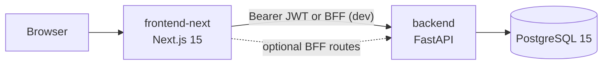

# OnTrack

**Meal planning, nutrition targets, and household food budgeting** — one workspace for the whole household.

[](https://github.com/tomekmisiun/OnTrack/actions/workflows/ci.yml)
[](https://www.python.org/)
[](https://fastapi.tiangolo.com/)
[](https://nextjs.org/)
[](https://www.postgresql.org/)
[](https://railway.com/)

OnTrack helps households plan meals, track nutrition, and control food spending without juggling spreadsheets and separate apps. The production stack is **FastAPI + Next.js 15 + PostgreSQL 15**, deployed to **Railway** via a gated CI pipeline.

> Verified routes, CI jobs, and feature status: [docs/project/current-state.md](docs/project/current-state.md)

---

## Table of contents

- [Overview](#overview)
- [Key features](#key-features)
- [Architecture](#architecture)
- [Technology stack](#technology-stack)
- [Getting started](#getting-started)
- [Configuration](#configuration)
- [Development](#development)
- [Testing](#testing)
- [Deployment](#deployment)
- [Documentation](#documentation)
- [Security](#security)
- [Repository layout](#repository-layout)

---

## Overview

**Problem:** Household meal planning, nutrition tracking, and grocery budgeting often live in separate tools or spreadsheets.

**Solution:** OnTrack combines a shared meal calendar, product and recipe catalogs, per-member nutrition targets, budget summaries, and export in a single web application.

**Typical flow:** Register or log in → add household members → manage products and recipes → plan meals on the calendar → review summary and export a shopping list.

**Scope:** Multi-user household app with global product/recipe catalog by market. Not a generic ERP, not multi-tenant SaaS.

---

## Key features

| Area | Capabilities |
|------|----------------|
| **Meal planning** | Calendar with drag-and-drop, favorites, day schedule, per-member toggles |
| **Catalog** | User products/recipes plus imported global catalog (market-aware) |
| **Nutrition** | Macro targets, BMI/TDEE calculator, optional fuel price lookup |
| **Budget & export** | Summary views, CSV/HTML export |
| **Auth** | Email register/login, JWT, optional Google OAuth, password reset (SMTP) |
| **Locale vs market** | UI language (PL/EN) independent of product market (PL/GB) |
| **Public widget** | Dish compare on login page (`/api/public/dish-compare`) |

**Optional / not enabled in production by default:** HttpOnly cookie BFF mode, Sentry, Grafana/Prometheus (local Compose only).

---

## Architecture



**Deploy pipeline (on `main`):** GitHub Actions CI → Railway staging → auth smoke → manual production approval → production deploy → auth smoke.

Component details, auth flow, and observability: [docs/architecture/overview.md](docs/architecture/overview.md)

---

## Technology stack

| Area | Technology | Role |
|------|------------|------|
| API | FastAPI, Alembic, Pydantic | HTTP API, migrations, schemas |
| Frontend | Next.js 15, React 19, TypeScript | App Router UI |
| Database | PostgreSQL 15 | Persistent storage |
| Tests | pytest, Vitest | Backend and frontend unit/contract tests |
| CI/CD | GitHub Actions | 5 PR quality jobs; staged Railway deploy |
| Hosting | Railway | `ontrack-back` + `ontrackapp` services |

---

## Getting started

**Prerequisites:** Docker + Compose (recommended), or Python 3.14 + [uv](https://docs.astral.sh/uv/) + Node.js 24 + PostgreSQL 15.

From the repository root:

```bash
cp .env.example .env
# Edit .env — minimum: POSTGRES_*, FLASK_SECRET_KEY, JWT_SECRET_KEY

docker compose up --build
```

| Service | URL |
|---------|-----|
| App | http://localhost:3000 |
| API | http://localhost:5001 |
| OpenAPI | http://localhost:5001/docs |

Without Docker: [docs/development/README.md](docs/development/README.md)

---

## Configuration

Copy `.env.example` → `.env`. Never commit secrets.

| Variable | Required | Purpose |
|----------|----------|---------|
| `POSTGRES_USER`, `POSTGRES_PASSWORD`, `POSTGRES_DB` | Yes (Compose) | Database credentials |
| `FLASK_SECRET_KEY` | Yes | OAuth session cookie signing |
| `JWT_SECRET_KEY` | Yes | JWT signing |
| `NEXT_PUBLIC_API_URL` | Yes | Frontend → API base URL |
| `GOOGLE_*` | No | Google OAuth |
| `SMTP_*` | No | Password reset email |
| `GEMINI_API_KEY`, `PEXELS_API_KEY`, `DEEPSEEK_API_KEY` | No | Optional integrations |

Full reference: [.env.example](.env.example) · [docs/development/README.md](docs/development/README.md)

---

## Development

| Task | Command |
|------|---------|
| Backend (local) | `cd backend && uv sync --dev && uv run alembic upgrade head && uv run uvicorn app.main:app --reload --port 5001` |
| Frontend (local) | `cd frontend-next && npm ci && npm run dev` |
| Regenerate API types | `cd frontend-next && npm run export:openapi && npm run generate:api` |
| Workflow validation | `make validate` |

Component guides: [backend/README.md](backend/README.md) · [frontend-next/README.md](frontend-next/README.md)

---

## Testing

| Scope | Command |
|-------|---------|
| Backend CI subset | `make test` |
| Backend (no Postgres) | `make test-backend` |
| Backend integration | `make test-integration` *(needs `TEST_DATABASE_URL`)* |
| Frontend unit | `make test-frontend` |

Browser E2E (Playwright) is not used. Strategy and CI mapping: [docs/testing/README.md](docs/testing/README.md)

---

## Deployment

Changes merge to `main` only through PR with green CI. Deploy is automatic after merge:

1. Railway **staging** deploy + readiness check  
2. Staging auth smoke  
3. GitHub Environment approval for **production**  
4. Production deploy + auth smoke  

Runbook: [docs/operations/deployment.md](docs/operations/deployment.md) · [`.github/DEPLOY.md`](.github/DEPLOY.md)

---

## Documentation

Full index: **[docs/README.md](docs/README.md)**

| Topic | Document |
|-------|----------|
| Current state | [docs/project/current-state.md](docs/project/current-state.md) |
| Architecture | [docs/architecture/overview.md](docs/architecture/overview.md) |
| Local setup | [docs/development/README.md](docs/development/README.md) |
| Testing | [docs/testing/README.md](docs/testing/README.md) |
| Deployment | [docs/operations/deployment.md](docs/operations/deployment.md) |
| Security | [docs/security/overview.md](docs/security/overview.md) |
| API contract | [docs/specs/api-contract.md](docs/specs/api-contract.md) |
| Roadmap & debt | [docs/project/roadmap.md](docs/project/roadmap.md) · [docs/project/tech-debt.md](docs/project/tech-debt.md) |
| ADRs | [docs/adr/](docs/adr/) |

Agent workflow: [docs/development/ai/workflows.md](docs/development/ai/workflows.md) · [AGENTS.md](AGENTS.md)

---

## Security

- JWT stored in `localStorage` by default; optional HttpOnly BFF mode for local dev ([ADR 0001](docs/adr/0001-bff-production-mode.md))
- Password reset requires SMTP configuration
- Never commit `.env` or production secrets

Details: [docs/security/overview.md](docs/security/overview.md) · [docs/project/tech-debt.md](docs/project/tech-debt.md)

---

## Repository layout

```
backend/           FastAPI API, Alembic, tests
frontend-next/     Production Next.js frontend
docs/              Project documentation (themed subdirectories)
archive/           Historical code snapshots (not deployed)
.ai-rules/         Agent binding rules
```

---

**OnTrack** — meal planner and budgeter for households.
