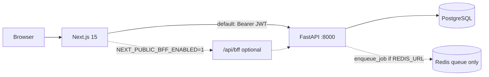

# OnTrack — Current State Audit

> **Archived 2026-06-27.** Do not use for operations. See [`docs/CURRENT_STATE.md`](../../CURRENT_STATE.md).

**Audit date:** 2026-06-26  
**Baseline commit:** `88aa1b9f1736a0f439bfd1c3124288efd29aa52b` (`main`) — Merge PR #141 (nutrition data cleanup)  
**Local branch at audit time:** `docs/nutrition-data-architecture` (aligned with `origin/main` at audit commit)  
**Working tree:** clean after validation (generated JSON drift reverted)  
**Method:** code-first verification; stale audit claims re-checked; non-destructive validation commands executed locally.

**Supersedes for current-state questions:** [`docs/audits/archive/2026-05-26_FULL_PROJECT_AUDIT.md`](archive/2026-05-26_FULL_PROJECT_AUDIT.md), [`docs/audits/archive/2026-05-26_PROJECT_TECHNICAL_AUDIT.md`](archive/2026-05-26_PROJECT_TECHNICAL_AUDIT.md).

---

## 1. Executive summary

OnTrack is a **working full-stack meal-planning application** on **FastAPI + Next.js 15 + PostgreSQL 15**, deployed to **Railway** via **GitHub Actions** after green CI on `main`. Core user journeys (auth, products, recipes, calendar, schedule, summary, export, dish-compare) are implemented with strong **contract-test** coverage (**198 backend tests**, **43 frontend unit tests**, Playwright smoke + full-stack auth E2E in CI).

**Production path:** Browser → Next.js (`frontend-next`) → FastAPI (`backend`) with **Bearer JWT in `localStorage`** (default). Optional BFF (`NEXT_PUBLIC_BFF_ENABLED=1`) exists but is **off in production Railway config**.

**Recent cleanup (PRs #138–#141):** macro lookup simplified to `canonical → generated catalog → AI cache → DeepSeek`; legacy `seeds/`, `ingredients_macros.json`, and root `scraper/` removed/archived; login catalog counts corrected.

**Main gaps vs README/marketing:**
- **Redis/worker** is infrastructure scaffold, not a running product feature in production CI deploy.
- **Grafana** has no provisioning; **Prometheus** is local Compose only.
- **Middleware** uses cookie *presence*, not JWT validation.
- **Password reset** has API endpoints but **no email delivery** (token exposed only in debug/testing).
- **Documentation sprawl:** 33+ markdown files under `docs/`, many migration-era reports contradict current code.

**Verdict:** **PARTIALLY production-ready** — suitable for portfolio/demo with configured secrets; ops hardening (worker decision, observability, README truth, doc consolidation) remains.

---

## 2. Baseline

### 2.1 Repository state

| Item | Value |
|------|-------|
| Default branch | `main` |
| Audit commit | `88aa1b9f1736a0f439bfd1c3124288efd29aa52b` |
| Last merge | PR #141 — docs/nutrition data architecture + prior cleanup stack |

### 2.2 Runtime versions (from repo, not host)

| Component | Version / constraint | Source |
|-----------|---------------------|--------|
| Python | 3.14 (`>=3.14,<3.15`) | `backend/pyproject.toml`, `backend/Dockerfile` |
| FastAPI | 0.115.x (lock: 0.115.14) | `backend/pyproject.toml` |
| SQLAlchemy | 2.0.x | `backend/pyproject.toml` |
| Alembic head | `a2b3c4d5e6f7` | `backend/alembic/versions/` |
| Next.js | ^15.5.19 | `frontend-next/package.json` |
| React | 19.1.0 | `frontend-next/package.json` |
| Node (CI/Docker) | 24 | `.github/workflows/ci.yml`, Dockerfiles |
| PostgreSQL | 15 | `docker-compose.yml`, CI services |
| Redis | 7-alpine | `docker-compose.yml` |

### 2.3 Deployable components

| Component | Local (Compose) | Production (Railway) | CI deploy |
|-----------|-----------------|---------------------|-----------|
| FastAPI API (`ontrack-back`) | ✅ `backend:5001→8000` | ✅ `backend/railway.toml` | ✅ `deploy-production` |
| Next.js (`ontrackapp`) | ✅ `:3000` | ✅ `frontend-next/railway.toml` | ✅ |
| PostgreSQL | ✅ | ✅ plugin | — |
| Redis | ✅ | ✅ plugin (optional for worker) | — |
| Worker (`ontrack-worker`) | ❌ no Compose service | ⚙️ config exists, **not in CI deploy** | ❌ |
| Prometheus | ✅ `:9090` | ❌ | ❌ |
| Grafana | ✅ `:3001` (empty) | ❌ | ❌ |

---

## 3. Architecture (verified)

### 3.1 Frontend → backend



| Question | Answer | Evidence |
|----------|--------|----------|
| Default path | Browser → FastAPI with Bearer JWT | `lib/api/client.ts`, `lib/bff/config.ts` (BFF default off) |
| BFF exists? | Yes, opt-in | `app/api/bff/[...path]/route.ts`, `app/api/auth/session/route.ts` |
| BFF production? | **Not enabled** | No `NEXT_PUBLIC_BFF_ENABLED` in `frontend-next/railway.toml` |
| Token storage (default) | `localStorage` key `token` + hint cookie `ontrack_has_token=1` | `lib/auth/storage.ts`, `lib/auth/session-cookie.ts` |
| Token storage (BFF) | HttpOnly `ontrack_session` | `lib/bff/cookies.ts` |
| Middleware | Cookie **presence** only; not JWT validation | `middleware.ts:19-21` |
| OAuth | FastAPI `/api/auth/google` → redirect `?code=` → frontend exchange | `lib/api/auth.ts:googleAuthUrl`, `backend/app/api/routes/auth.py` |
| OpenAPI drift | CI checks `frontend-next/openapi/openapi.json` | `.github/workflows/ci.yml` export + `git diff` |

### 3.2 Backend layers

| Layer | Location | Notes |
|-------|----------|-------|
| Routes | `backend/app/api/routes/` | Thin; delegate to services |
| Services | `backend/app/services/` | Business logic (22 modules) |
| Models | `backend/app/models/` | SQLAlchemy |
| Domain | `backend/app/domain/` | Pure helpers |
| Data | `backend/data/canonical/` → `generated/` → `import_catalog` | Single catalog pipeline |

**Public endpoints:** `/health`, `/health/ready`, `/metrics`, auth login/register/exchange/OAuth, `/api/fuel/prices`, `/api/public/dish-compare`.

**Startup:** `ensure_global_catalog_loaded()` on lifespan (non-testing) — `backend/app/main.py:29-40`.

### 3.3 Redis and worker

| Aspect | State | Evidence |
|--------|-------|----------|
| Redis usage | **Worker queue only** | `app/worker/queue.py`; no cache/session use |
| Without `REDIS_URL` | Jobs run **inline sync** | `queue.py:59-61` |
| `process_job()` | **Rejects all job types** | `app/worker/jobs.py:10-11` |
| Production enqueue | **None** | grep: only tests call `enqueue_job` |
| Local worker | **Not in Compose** | `docker-compose.yml` has redis, no worker service |
| Railway worker | Config `railway.worker.prod.toml` exists; **not deployed by CI** | `.github/workflows/ci.yml` deploy job |
| Status | **SCAFFOLD** | README partially acknowledges |

### 3.4 Observability

| Endpoint / tool | Status | Evidence |
|-----------------|--------|----------|
| `GET /health` | ACTIVE | `main.py:71-73` |
| `GET /health/ready` | ACTIVE (DB ping) | `main.py:75-84`, tests |
| `GET /metrics` | ACTIVE (`ontrack_up`, `ontrack_db_up`) | `main.py:86-104` |
| Prometheus (local) | PARTIAL — scrapes `backend:8000/metrics` | `monitoring/prometheus.yml` |
| Grafana (local) | SCAFFOLD — no datasource/dashboard provisioning | `docker-compose.yml`; no `monitoring/grafana/` |
| Structured logs / tracing | UNVERIFIED / minimal | standard uvicorn logging |
| Worker metrics | None | — |

### 3.5 External integrations (runtime)

| Integration | Used for | Required env | Graceful degrade |
|-------------|----------|--------------|------------------|
| Google OAuth | Login | `GOOGLE_CLIENT_*` | 503 / redirect error |
| DeepSeek | Macro lookup fallback | `DEEPSEEK_API_KEY` | catalog-first; then `ai_not_configured` |
| Gemini | Receipt parse, recipe image search term | `GEMINI_API_KEY` | import/image features limited |
| Pexels | Recipe images | `PEXELS_API_KEY` | fetch-image fails |
| Fuel scrapers | PL/EN fuel prices | none | public scrape |

### 3.6 Catalog / nutrition data (post-cleanup)

```
canonical/products.json → build_catalog → generated/products_{PL,GB}.json
  → import_catalog → PostgreSQL
  → /api/nutrition/lookup: catalog → macro_ai_cache → DeepSeek
```

Scraper archived: `archive/scraper-legacy/`. Legacy `backend/data/seeds/` removed.

---

## 4. Current state matrix

| Area | Status | Evidence | Risk | Target action |
|------|--------|----------|------|---------------|
| Frontend Next.js | **ACTIVE** | Compose + Railway + 43 Vitest + E2E CI | Middleware hint bypass for UX only | README auth section clarity |
| FastAPI API | **ACTIVE** | 198 pytest, contract suite, `/health/ready` | Catalog load at cold start | Document startup cost |
| Auth JWT | **ACTIVE** | `test_auth_contract.py`, refresh implemented | XSS steals localStorage token | BFF decision doc |
| BFF | **OPTIONAL** | Code complete; default off | Cookie mode untested in prod | Explicit ADR |
| PostgreSQL | **ACTIVE** | Alembic, integration CI | Manual prod migration discipline | Runbook already exists |
| Redis | **PARTIAL** | Compose + Railway plugin | Cost without worker value | Worker decision |
| Worker | **SCAFFOLD** | `jobs.py` rejects all | Misleading README/Railway service | Implement or remove |
| Scraper | **DEPRECATED** | `archive/scraper-legacy/` | README still mentions pipeline | README fix |
| Prometheus | **OPTIONAL** | Local Compose only | No prod monitoring | Document scope |
| Grafana | **SCAFFOLD** | Container only | False expectation | Provision or remove from README |
| Railway deploy | **ACTIVE** | CI deploy on green main | Deploy job can timeout (historical) | Keep runbook |
| CI | **ACTIVE** | 8 jobs in workflow (incl. deploy on main) | Subset of 198 tests in `test` job | Document matrix |
| Documentation | **PARTIAL** | 33 files, many stale | Wrong onboarding | Consolidation roadmap |
| OpenAPI contract | **ACTIVE** | Drift check in CI | `schema.ts` not drift-checked | Optional CI extension |
| Password reset | **PARTIAL** | API + tests; no email | Users cannot reset in prod | Document limitation or add email |
| DishCompare | **ACTIVE** | `/api/public/dish-compare`, login showcase | Static JSON data | Mark as demo dataset |

---

## 5. README audit (section-by-section)

| # | Section | Verdict | Issue | Correct source |
|---|---------|---------|-------|----------------|
| 1 | Product / value prop | **Correct** | — | Code + routes |
| 2 | CI badges | **Correct** | Links to workflow | GitHub Actions |
| 3 | Live app link | **Missing** | No production URL in README | Railway / user |
| 4 | Screenshots / demo | **Partial** | Demo webms in CRA archive; Next login has dish-compare | `archive/frontend-cra-reference/public/demos/` |
| 5 | TOC | **Correct** | Long but navigable | — |
| 6 | Core capabilities | **Stale** | Lists "offline scraper pipeline" | `archive/scraper-legacy/` |
| 7 | Tech stack | **Mostly correct** | Redis badge "Queue & Cache" — cache unused | `worker/queue.py` |
| 8 | Architecture diagram | **Mostly correct** | Worker shown as optional (OK) | — |
| 9 | Auth flow | **Incomplete** | Doesn't state middleware is hint-only; BFF default off buried in env table | `middleware.ts`, `FRONTEND_NEXT_BFF.md` |
| 10 | BFF / HttpOnly | **Partial** | Documented as optional env; not in architecture narrative | `lib/bff/config.ts` |
| 11 | PostgreSQL | **Correct** | — | Compose, Railway |
| 12 | Redis | **Misleading** | "Queue & Cache" — no app cache | Code |
| 13 | Worker | **Partial** | Project status says "limited runtime role" (good); deployment table lists service | `jobs.py` |
| 14 | Integrations | **Stale** | `DEEPSEEK_API_KEY` described as "scraper pipeline" | `macro_lookup.py` |
| 15 | Monitoring | **Overstated** | Lists Grafana/Prometheus as stack badges; no note that Grafana is unprovisioned | `docker-compose.yml` |
| 16 | Quick start | **Correct** | Migrations manual step after compose up | `run-migrations.sh` |
| 17 | Env vars | **Mostly correct** | Missing `REDIS_URL`, `API_INTERNAL_URL`, `RUNTIME_DATA_DIR` | `config.py`, `env.ts` |
| 18 | Testing | **Correct** | Matches CI subset + integration instructions | `ci.yml` |
| 19 | CI jobs | **Correct** | Lists 7 test jobs; omits `deploy-production` | `ci.yml` |
| 20 | Deployment | **Correct** | Points to DEPLOY.md | `.github/DEPLOY.md` |
| 21 | Repo structure | **Correct** | Reflects post-archive layout | tree |
| 22 | API overview | **Correct** | Includes `/metrics` | `main.py` |
| 23 | Limitations | **Weak** | No explicit worker/BFF/reset-email limits | This audit |
| 24 | Security model | **Incomplete** | No XSS/localStorage discussion | `FRONTEND_NEXT_BFF.md` |
| 25 | Status labels | **Partial** | Good project status table; core capabilities stale | — |
| 26 | Roadmap / readiness | **Points to stale audit** | Badge → FULL_PROJECT_AUDIT (2026-05-26) | This document |

### Proposed README TOC (target — not implemented in this task)

1. About  
2. Features (remove scraper; clarify demo vs prod)  
3. Architecture (single diagram: Browser → Next → FastAPI → PG)  
4. Auth modes (default JWT vs optional BFF) — **new subsection**  
5. Tech stack (accurate Redis/worker labels)  
6. Quick start  
7. Environment variables  
8. Testing & CI (include deploy job)  
9. API & OpenAPI  
10. Localization & markets  
11. Deployment (Railway)  
12. Observability (local only; scope)  
13. Documentation index (point to canonical docs)  
14. Project status & limitations  
15. License  

---

## 6. Documentation contradictions

| ID | Document A | Document B / code | Contradiction | Current truth | Recommended action |
|----|------------|-------------------|---------------|---------------|-------------------|
| C01 | `FULL_PROJECT_AUDIT.md` §6 | `auth_service.py`, `test_auth_contract.py` | Claims password reset not implemented | **Implemented** (no email in prod) | ARCHIVE audit; UPDATE README limitation |
| C02 | `FULL_PROJECT_AUDIT.md` §6 | `auth.py` `/refresh` | Claims JWT refresh missing | **Implemented** | ARCHIVE old audit |
| C03 | `FULL_PROJECT_AUDIT.md` §13 | `monitoring/prometheus.yml`, `main.py` | Said no `/metrics` | **Exists** | ARCHIVE |
| C04 | `FULL_PROJECT_AUDIT.md` §13 | `prometheus.yml` line 587 | Same | Fixed in remediation | ARCHIVE |
| C05 | `PROJECT_TECHNICAL_AUDIT.md` | Repo tree | CRA `frontend/` as production UI | **Next.js only**; CRA in `archive/` | ARCHIVE |
| C06 | `README.md` core capabilities | `archive/scraper-legacy/` | "offline scraper pipeline" active feature | **Archived, not runtime** | UPDATE README |
| C07 | `README.md` env table | `macro_lookup.py` | DeepSeek tied to scraper | **Nutrition lookup only** | UPDATE README |
| C08 | `README.md` Redis badge | `queue.py` | "Queue & Cache" | **Queue only** | UPDATE README |
| C09 | `DATA_DEPLOYMENT_ROADMAP.md` | Repo root | Shows `scraper/` at root | **Moved to archive** | UPDATE or ARCHIVE |
| C10 | `backend-migration/README.md` | `API_CONTRACT.md` | Contract via `frontend/src/api.js` | **`frontend-next/lib/api/`** | UPDATE README index |
| C11 | `CUTOVER_AND_ROLLBACK.md` | Production | Flask rollback procedure | **Flask removed** | ARCHIVE |
| C12 | `ADAPTATION_CHECKLIST.md` | Compose | Services `app`, `frontend` | **`backend`, `frontend-next`** | ARCHIVE |
| C13 | `CRA_NEXT_FINAL_PARITY_REPORT.md` | `CRA_NEXT_FULL_REGRESSION_AUDIT.md` | "COMPLETE" vs open doc gaps | Both historical | ARCHIVE both |
| C14 | `README.md` audit badge | This document | Points to May 26 audit | **June 26 state differs** | UPDATE badge link |
| C15 | `PROJECT_TECHNICAL_AUDIT.md` | `docker-compose.yml` | Worker in Compose | **No worker service** | ARCHIVE |
| C16 | `import.ts` vs audit | `lib/api/import.ts` | BFF import broken (AUDIT-009) | **Fixed** (routes via BFF when enabled) | Close in new audit |
| C17 | `frontend-next` README | — | May exist with stale info | Verify in DOC-003 task | UPDATE if needed |

---

## 7. Documentation cleanup classification

| Document | Freshness | Problem | Action | Migrate content to | Links to fix |
|----------|-----------|---------|--------|-------------------|--------------|
| `docs/CURRENT_STATE.md` | Current | — | **KEEP** (canonical) | — | README badge |
| `docs/audits/FULL_PROJECT_AUDIT.md` | Stale (May 26) | Superseded; some wrong post-fix | **ARCHIVE** | This audit | README, badges |
| `docs/PROJECT_TECHNICAL_AUDIT.md` | Stale (CRA era) | Wrong frontend | **ARCHIVE** | This audit | README |
| `docs/CRA_NEXT_*` (3 files) | Historical | Migration timeline | **ARCHIVE** | `docs/CRA_REFERENCE.md` | README migration badge |
| `docs/FRONTEND_NEXT_MIGRATION_PLAN.md` | Complete | Task cards done | **ARCHIVE** | CRA_REFERENCE | — |
| `docs/FRONTEND_NEXT_BFF.md` | Current | Decision doc | **KEEP** | — | README auth |
| `docs/CRA_REFERENCE.md` | Current | Archive guide | **KEEP** | — | — |
| `docs/backend-migration/API_CONTRACT.md` | Mostly current | Minor legacy mentions | **KEEP** + UPDATE | — | — |
| `docs/backend-migration/README.md` | Stale index | Wrong paths | **UPDATE** | — | — |
| `docs/backend-migration/AUTH_COMPATIBILITY.md` | Historical + ref | Still useful | **KEEP** | — | — |
| `docs/backend-migration/DATABASE_COMPATIBILITY.md` | Historical + ref | Alembic context | **KEEP** | — | — |
| `docs/backend-migration/CURRENT_FLASK_INVENTORY.md` | Obsolete | Flask snapshot | **ARCHIVE** | — | — |
| `docs/backend-migration/CUTOVER_AND_ROLLBACK.md` | Obsolete | Flask rollback | **ARCHIVE** | `deployment/RAILWAY_*` | — |
| `docs/backend-migration/PRODUCTION_CUTOVER.md` | Obsolete | Historical checklist | **ARCHIVE** | deployment runbooks | — |
| `docs/backend-migration/MIGRATION_ROADMAP.md` | Complete | MIG tasks done | **ARCHIVE** | — | README |
| `docs/backend-migration/DATA_DEPLOYMENT_ROADMAP.md` | Mostly complete | Scraper path stale | **ARCHIVE** | `backend/data/README.md` | — |
| `docs/backend-migration/PRODUCT_CATALOG_ROADMAP.md` | Mostly complete | CAT tasks done | **ARCHIVE** | `backend/data/README.md` | — |
| `docs/backend-migration/TARGET_ARCHITECTURE.md` | Pre-cutover | Wrong layout | **ARCHIVE** | — | — |
| `docs/backend-migration/TEMPLATE_TRIM_MATRIX.md` | Obsolete | Template migration | **ARCHIVE** | — | — |
| `docs/backend-migration/ARCHIVED_CUTOVER_DOCS.md` | Meta | Still useful index | **KEEP** | — | — |
| `docs/backend-migration/DB_REHEARSAL.md` | Ops | Staging rehearsal | **KEEP** | — | — |
| `docs/backend-migration/RAILWAY_STAGING.md` | Ops | Staging deploy | **KEEP** | — | — |
| `docs/deployment/RAILWAY_BACKEND_MIGRATION.md` | Current | Primary deploy runbook | **KEEP** | — | README |
| `docs/deployment/RAILWAY_AUTH_PRODUCTION_VERIFY.md` | Current | Auth smoke | **KEEP** | — | README |
| `docs/ADAPTATION_CHECKLIST.md` | Obsolete | ai-rules template checklist | **ARCHIVE** | — | — |
| Agent tooling docs (`ai-workflows.md`, etc.) | Current | Not product docs | **KEEP** | — | AGENTS.md |
| `docs/specs/README.md` | Placeholder | No specs yet | **KEEP** | — | — |
| `.github/DEPLOY.md` | Current | Deploy truth | **KEEP** | — | README |

---

## 8. Validation results (2026-06-26)

| Command | Result | Notes |
|---------|--------|-------|
| `git status --short` | PASS (clean after revert) | Generated JSON modified during `build_catalog` — reverted |
| `git branch --show-current` | `docs/nutrition-data-architecture` | Same commit as `main` at audit SHA |
| `git log -1 --oneline` | `88aa1b9` | |
| `docker compose config` | PASS | Valid compose |
| `cd backend && uv sync --dev` | PASS | |
| `uv run ruff check .` | PASS | All checks passed |
| `uv run pytest -q` | PASS | **198 passed**, 7 skipped |
| `uv run python -m app.scripts.build_catalog --check` | PASS | |
| `uv run python scripts/validate_runtime_data.py` | PASS | |
| OpenAPI export + drift | PASS | `git diff --exit-code openapi/openapi.json` → 0 |
| `cd frontend-next && npm ci` | PASS | |
| `npm run test` | PASS | **43 passed** |
| `npm run lint` | PASS (3 warnings) | react-hooks/exhaustive-deps |
| `npm run typecheck` | PASS | |
| `npm run build` | PASS | Next.js production build |
| `docker build backend` | PASS | Local verification |
| `docker build frontend-next/Dockerfile.railway` | **NOT RUN** | CI job `frontend-next-docker` covers this |
| `npm run test:e2e` | **NOT RUN** | CI covers; local needs Playwright browsers |
| `npm run test:e2e:auth` | **NOT RUN** | Requires Postgres + backend stack |
| Production smoke (`verify-production-auth.sh`) | **NOT RUN** | Needs live Railway + secrets |

---

## 9. Fixed since older audits (confirmed)

| Old claim | Current state | Evidence |
|-----------|---------------|----------|
| No `/metrics` | **Fixed** | `main.py`, CI health tests |
| BFF import broken | **Fixed** | `lib/api/import.ts` |
| Account deletion FK with favorites | **Fixed** (per FULL_PROJECT_AUDIT remediation) | PR #118+ |
| CRA `frontend/` in repo root | **Archived** | `archive/frontend-cra-reference/` |
| Macro lookup via 8-entry `ingredients_macros` | **Removed** | PR #138; catalog-only |
| `scraper/` at repo root | **Archived** | PR #139 |
| Legacy `backend/data/seeds/` | **Removed** | PR #139 |
| Node 20 CI deprecation | **Fixed** | PR #137 — Node 24 |
| Welcome stats wrong counts | **Fixed** | PR #134 |
| DeepSeek macro lookup broken (missing openai) | **Fixed** | PR #136 |

---

## 10. Still open / unverified

| Item | Status |
|------|--------|
| Worker production value | SCAFFOLD — decision needed |
| BFF production rollout | UNVERIFIED — default off |
| Password reset email delivery | NOT IMPLEMENTED |
| Grafana dashboards | NOT IMPLEMENTED |
| Production auth smoke (live) | NOT RUN this audit |
| JWT revocation / logout server-side | NOT IMPLEMENTED (client clears token) |
| `schema.ts` OpenAPI drift in CI | NOT CHECKED (only `openapi.json`) |
| Railway `macro_ai_cache.json` persistence | Ephemeral disk — cache lost on redeploy |

---

## 11. BFF decision options (for roadmap — no decision taken)

| Option | Pros | Cons |
|--------|------|------|
| A. Keep BFF off (status quo) | Simple; matches prod; CRA parity | XSS token theft risk |
| B. Enable BFF in production | HttpOnly JWT; SameSite cookies | Requires CSRF strategy; full E2E in BFF mode |
| C. Remove BFF code | Less maintenance | Loses opt-in hardening path |
| D. BFF + refresh rotation | Strongest session | Highest effort |

**Recommendation:** Document A as current production; run **spike task** before B (BFF prod E2E + CSRF note in ADR).

---

## 12. Worker decision options (for roadmap — no decision taken)

| Option | Pros | Cons |
|--------|------|------|
| A. Remove worker service + simplify Redis | Honest architecture; lower cost | Removes future async path |
| B. Keep scaffold, don't deploy worker | Config ready | Redis cost on Railway without benefit |
| C. Implement first real job (e.g. async import parse) | Justifies Redis | Scope + monitoring needed |

**Recommendation:** **A or C** — not B long-term. If no job planned in 1 quarter, remove worker Railway service and document sync-only queue fallback.

---

*End of audit. Remediation tasks: `docs/PROJECT_REMEDIATION_ROADMAP.md`.*
