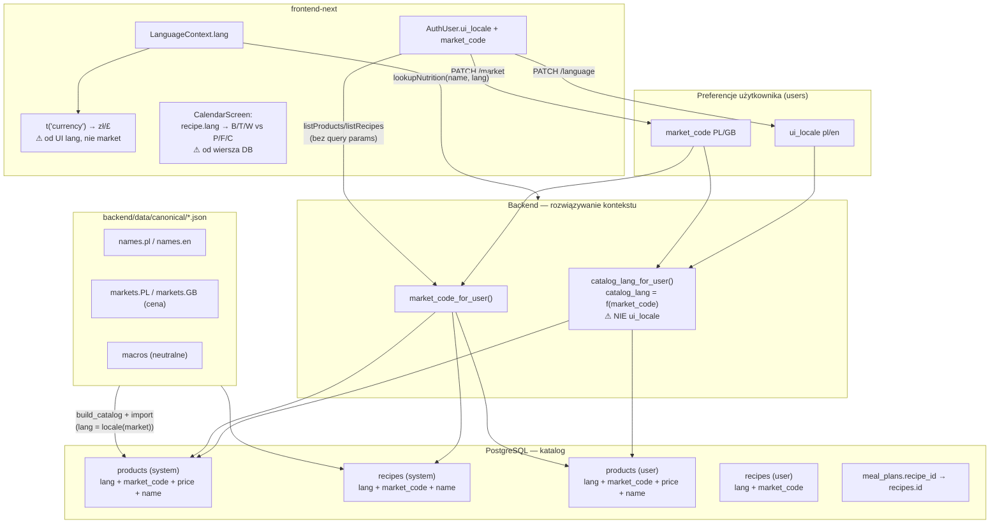

# Audyt: separacja `ui_locale` vs `market_code`

**Data:** 2026-06-27  
**Status:** audyt + plan naprawy (bez implementacji)  
**Zakres:** backend (`backend/`), frontend produkcyjny (`frontend-next/`), dane katalogowe (`backend/data/`)

---

## Streszczenie wykonawcze

OnTrack ma **częściową** separację `ui_locale` i `market_code` na poziomie profilu użytkownika (osobne endpointy, osobne pola w DB), ale **katalog systemowy nadal wiąże język nazw z rynkiem**, a frontend wiąże **walutę z językiem UI**. To powoduje objawy opisane przez użytkownika (np. PL UI + GB market → polskie nazwy z funtami, albo odwrotnie angielskie makra przy polskim UI).

| Warstwa | Ocena | Główny problem |
|---------|-------|----------------|
| **Baza danych** | Częściowo gotowa | Kanoniczny JSON ma `names.*` + `markets.*`, ale import tworzy **osobne wiersze per rynek** z `lang` na stałe powiązanym z rynkiem |
| **Backend API** | Częściowo poprawny | `PATCH /language` nie rusza rynku; `PATCH /market` nie rusza locale — ale **filtrowanie katalogu używa `catalog_lang = f(market)`**, nie `ui_locale` |
| **Frontend** | Główne źródło regresji UX | Waluta z `t("currency")` (UI lang), karuzela kalendarza używa `recipe.lang` dla B/T/W vs P/F/C, lookup makro po UI lang |

**Główna przyczyna odwrotnego powiązania:** funkcja `catalog_lang_for_user()` w `backend/app/services/user_preferences.py:50-51` mapuje `market_code → lang` (`PL→pl`, `GB→en`), a nie `ui_locale`. Nazwy systemowe pochodzą więc z rynku, nie z języka interfejsu.

**Rekomendacja:** naprawa etapowa — najpierw frontend (waluta, etykiety makro), potem backend (prezentacja katalogu po `ui_locale` + ceny po `market_code`), na końcu opcjonalna normalizacja schematu DB. **Nie wdrażać pełnej normalizacji (`product_translations`) bez zatwierdzonego planu migracji.**

---

## 1. Diagram aktualnego przepływu danych



### Przepływ zmiany języka (obecny)

```
Profile → PATCH /api/auth/language { lang }
  → apply_ui_locale() — tylko users.ui_locale
  → sync_primary_member_name (Ja ↔ Me)
  → NIE zmienia market_code
  → NIE przeładowuje katalogu po ui_locale (backend filtruje po catalog_lang = f(market))
  → Frontend: switchLang() — odświeża tłumaczenia UI
  → Frontend: NIE przeładowuje list produktów/przepisów (hooks: user?.market_code only)
```

### Przepływ zmiany rynku (obecny)

```
Profile → PATCH /api/auth/market { market_code }
  → apply_market_code() — tylko users.market_code
  → NIE zmienia ui_locale
  → Backend: inny zestaw wierszy systemowych (market + lang)
  → Frontend: hooks useProductsPage/useRecipesPage/useCalendarPage/useSummaryPage
             re-fetch on user?.market_code change
```

---

## 2. Miejsca, gdzie język wpływa na cenę

| # | Miejsce | Mechanizm | Ocena |
|---|---------|-----------|-------|
| 1 | `frontend-next/lib/i18n/messages/pl/calendar.ts:70` vs `en/calendar.ts:70` | `currency: 'zł'` vs `'£'` wiązane z UI lang | **Bug UX** — EN UI + PL market pokazuje £ przy cenach PLN |
| 2 | `frontend-next/components/export/ExportScreen.tsx` (wiele miejsc) | `const L = lang === 'en'` wybiera £/zł w HTML export | **Bug UX** |
| 3 | `frontend-next/components/dish-compare/DishCompare.tsx:33` | `tString(t, "currency")` | **Bug UX** |
| 4 | `backend/app/services/user_preferences.py:50-51` | `catalog_lang_for_user` = f(market) — pośrednio: zmiana UI lang **nie** zmienia ceny (OK) | Poprawne dla API |
| 5 | Rejestracja `auth_service.py:108-111` | `market_code = default_market_for_ui_locale(lang)` | **Coupling przy signup** — nie zmienia ceny po fakcie, ale ustawia domyślny rynek = domyślną walutę |

**Wniosek:** backend **nie** zmienia ceny przy `PATCH /language` (potwierdzone testem `test_change_language_updates_ui_locale_only`). Użytkownik widzi „zmianę ceny” głównie przez **złą walutę w UI** (frontend) lub przez **domyślne powiązanie lang→market przy rejestracji**.

---

## 3. Miejsca, gdzie rynek wpływa na język

| # | Miejsce | Mechanizm | Ocena |
|---|---------|-----------|-------|
| 1 | `backend/app/domain/market.py:9-12` | `CATALOG_LANG_BY_MARKET: PL→pl, GB→en` | **Rdzeń problemu** |
| 2 | `backend/app/services/user_preferences.py:50-51` | `catalog_lang_for_user()` | **Rdzeń problemu** |
| 3 | `backend/app/services/product_service.py:67-98` | Filtr `Product.lang == catalog_lang` + `market_code` | Nazwy systemowe = język rynku |
| 4 | `backend/app/scripts/import_catalog.py:61-62, 71` | `_locale_for_market()` przy imporcie | PL wiersze z `lang=pl`, GB z `lang=en` |
| 5 | `backend/app/domain/catalog_seed.py:42-66` | `expand_products_catalog(catalog, lang)` generuje osobne pliki per market/lang | Build-time coupling |
| 6 | `backend/tests/test_catalog_pipeline.py:80-99` | Testy **oczekują** EN UI + PL market → katalog PL (polskie nazwy) | Dokumentuje obecne (błędne względem spec) zachowanie |
| 7 | `frontend-next/components/calendar/CalendarScreen.tsx:401-404` | `recipe.lang === "en"` → P/F/C | Etykiety makro z **lang wiersza przepisu** (= rynek), nie UI |
| 8 | `backend/app/services/macro_lookup.py:141-142` | `_market_for_lang(lang)` — lookup katalogu po lang→market | Nutrition lookup |

**Wniosek:** zmiana rynku **zmienia język nazw produktów/przepisów systemowych** (inny zestaw wiersów DB + inny `lang`). To jest **sprzeczne** z wymaganą specyfikacją.

---

## 4. Jak frontend wybiera etykiety makro

| Źródło | Gdzie | Kiedy używane |
|--------|-------|---------------|
| **UI locale** (`t("macro_p")`, `macro_f`, `macro_c`) | Products, Recipes, Calendar (preview, footer), Macro, Summary | Domyślnie wszędzie — PL→B/T/W, EN→P/F/C |
| **`recipe.lang`** (pole API) | `CalendarScreen.tsx:401-404` (karuzela miniaturek) | Wyjątek — B/T/W vs P/F/C z języka **wiersza przepisu** |
| **`product.lang`** | Parsowane w `types/product.ts`, **nigdzie nie używane** do etykiet | — |
| **`market_code`** | Nie używany do etykiet makro | — |

**Objaw:** UI EN + market PL → przepisy systemowe mają `recipe.lang=pl` → karuzela pokazuje **B/T/W**, reszta ekranu **P/F/C**.

---

## 5. Jak backend wybiera produkty według `lang` i `market_code`

```python
# product_service.py — _visible_products_query
Product.market_code == market_code_for_user(user)
Product.lang == catalog_lang_for_user(user)  # = catalog_lang_for_market(market)
```

Systemowe: `user_id IS NULL`, `source=system`, ten sam filtr.  
Własne: `user_id == user`, **oba** filtry `market_code` + `lang`.

Przepisy (`recipe_service.py:35-45`): filtr **tylko** `market_code` dla systemowych; user recipes **bez** filtra market/lang w `_visible_recipes_query`.

---

## 6. Odpowiedzi na 13 obowiązkowych pytań

| # | Pytanie | Odpowiedź |
|---|---------|-----------|
| 1 | Gdzie zmiana języka wpływa na cenę? | Po stronie API **nie** (test kontraktowy OK). Po stronie UI **tak** — symbol waluty z `t("currency")` zależy od UI lang, nie market. |
| 2 | Gdzie zmiana rynku wpływa na język? | `catalog_lang_for_market`, import katalogu, filtrowanie `Product.lang` / nazw systemowych, `recipe.lang` na wierszach, karuzela kalendarza. |
| 3 | Jak frontend wybiera etykiety makro? | Prawie wyłącznie `ui_locale` via i18n; wyjątek: `recipe.lang` w karuzeli. |
| 4 | Jak backend wybiera produkty? | `market_code` + `catalog_lang=f(market)`; **nie** `ui_locale`. |
| 5 | Czy ceny są na produkcie? | **Tak** — `products.price` bezpośrednio na wierszu; brak `product_market_prices`. |
| 6 | Czy produkty PL i EN to osobne rekordy? | **Tak** — osobne wiersze per `market_code` (PL zestaw ~445, GB ~205); `lang` zgodny z rynkiem. |
| 7 | Wspólny stabilny identyfikator? | W canonical: `key` (np. `"pineapple"`). W DB: `catalog_key` z prefiksem rynku (`catalog:pl:00000:pineapple` vs `catalog:gb:...`) — **różne między rynkami**, ten sam `stable_key` w canonical. |
| 8 | Przepisy PL i EN osobne rekordy? | **Tak** — `recipes` per `market_code`; `catalog_key` = `recipe:{market}:...`. |
| 9 | Czy zmiana profilu uruchamia seedowanie? | **Nie** — seed/import tylko globalny przy starcie app (`import_catalog`). Testy: register/login/me/language/market nie kopiują katalogu do użytkownika. |
| 10 | Produkty użytkownika — `lang` / `market_code`? | **Tak** — oba; ustawiane przy tworzeniu z bieżących preferencji użytkownika. |
| 11 | Czy filtry języka ukrywają produkty własne? | Filtr `lang == catalog_lang` (z rynku) **może ukryć** własny produkt po zmianie rynku (inny `market_code`/`lang` na wierszu). Zmiana samego UI lang — **nie** ukrywa (lang wiersza nie zależy od ui_locale). |
| 12 | Czy ceny produktów własnych zależą od rynku? | Cena jest na wierszu; widoczność zależy od `market_code` wiersza = aktualny rynek użytkownika. Brak automatycznej konwersji waluty — użytkownik widzi „starą” cenę w innym rynku dopóki wiersz jest ukryty. |
| 13 | Cache / localStorage? | `localStorage.lang`, `pending_lang`; `weekTemplates` (kalendarz/summary) **bez** scope market/lang; `macroGoals`, `drinksConfig` — bez invalidation przy zmianie rynku. |

---

## 7. Cztery kombinacje — oczekiwane vs aktualne

Legenda: ✅ zgodne ze spec · ⚠ częściowo · ❌ sprzeczne

| Kombinacja | Nazwa prod. system. (spec / aktualnie) | Makro UI (spec / aktualnie) | Waluta (spec / aktualnie) | Cena (spec / aktualnie) |
|------------|----------------------------------------|----------------------------|---------------------------|-------------------------|
| **PL + PL** | polska / polska ✅ | B/T/W / B/T/W ✅ | PLN / zł ✅ | PL / PL ✅ |
| **PL + GB** | polska / **angielska** ❌ | B/T/W / **mieszane** ⚠ (karuzela B/T/W, reszta OK) | GBP / **zł** ❌ | GB / GB ✅ |
| **EN + PL** | angielska / **polska** ❌ | P/F/C / **mieszane** ⚠ | PLN / **£** ❌ | PL / PL ✅ |
| **EN + GB** | angielska / angielska ✅ | P/F/C / P/F/C ✅ | GBP / £ ✅ | GB / GB ✅ |

### Produkty własne (wszystkie kombinacje)

| Zachowanie | Spec | Aktualnie |
|------------|------|-----------|
| Nazwa bez auto-tłumaczenia | ✅ | ✅ |
| Widoczność po zmianie języka | zawsze widoczny | ✅ (filtr lang wiersza = f(market), ui_locale nie szkodzi) |
| Widoczność po zmianie rynku | zawsze widoczny | ❌ ukryty jeśli `market_code`/`lang` wiersza ≠ nowy kontekst |
| Duplikacja | brak | ✅ brak (tylko hide) |

### Przepisy własne

| Zachowanie | Spec | Aktualnie |
|------------|------|-----------|
| Nazwa bez auto-tłumaczenia | ✅ | ✅ |
| Koszt po zmianie rynku | przeliczony z cen składników rynku | ⚠ zależy od widoczności produktów-składników |
| Lista po zmianie rynku | widoczny | ✅ (user recipes bez filtra market w list) |
| Meal plan po zmianie rynku | powiązania zachowane | ⚠ `recipe_id` wskazuje ten sam wiersz; system recipes niedostępne jeśli inny market |

---

## 8. Analiza bazy danych

### Obecny model (uproszczony)

```
users
  ui_locale, market_code → markets(code, default_locale, currency_code)

products
  id, catalog_key, name, price, lang, market_code
  kcal, protein, fat, carbs  ← neutralne makro
  user_id, source, base_product_id

recipes
  id, catalog_key, name, lang, market_code
  kcal_100g, protein_100g, fat_100g, carbs_100g
  user_id, source

recipe_ingredients → products.id
meal_plans → recipes.id
```

### Brakujące tabele (deferred, README:127-129)

- `product_translations` (name per locale)
- `product_markets` / `product_market_prices` (price per market)
- `recipe_translations`

### Klucze obce i ryzyka

| Ryzyko | Opis |
|--------|------|
| **Duplikaty logiczne** | Ten sam produkt canonical (`key=pineapple`) = 2 wiersze DB (PL, GB) z różnymi `id` |
| **Meal plan** | `meal_plans.recipe_id` — twardy FK; zmiana rynku nie mapuje na „ten sam” przepis w innym wierszu |
| **Recipe ingredients** | Link po `product_id`; produkty systemowe PL/GB to różne `id` dla tego samego `key` |
| **Indeksy redundantne** | `uq_products_lang_catalog_key_system` i `uq_products_market_catalog_key_system` — spójne z 1:1 lang↔market dziś |
| **User product override** | `base_product_id` — customizacja systemowego produktu per user/market |

### Koszt migracji do modelu docelowego

| Aspekt | Ocena |
|--------|-------|
| Dane canonical | **Gotowe** — `names.pl/en` + `markets.PL/GB` już istnieją |
| Backfill | Średni — wymaga mapowania `catalog_key` / `stable_key`, nie nazw |
| Zerwanie przepisów | **Wysokie** jeśli zmieni się `product_id` w składnikach bez mapy |
| Downtime | Można uniknąć etapami (dual-read) |
| Rollback | Alembic + revert generated JSON |

---

## 9. Analiza seedów i pipeline katalogu

1. **Źródło prawdy:** `backend/data/canonical/products.json`, `recipes.json`
2. **Build:** `app.scripts.build_catalog` → `generated/products_{PL,GB}.json` (nazwa + cena **już zlane** w jednym wierszu)
3. **Import:** `app.scripts.import_catalog` — upsert po `catalog_key` per market; `lang = _locale_for_market(market)`
4. **Runtime:** brak tłumaczeń w locie — „runtime auto-translation” wyraźnie wykluczone (README:19)

**Wniosek:** pipeline jest zoptymalizowany pod model „rynek = locale katalogu”, nie pod „locale UI ≠ locale katalogu”.

---

## 10. Produkty systemowe vs własne

### Systemowe

- Nazwa w DB = jedna wersja językowa (zgodna z rynkiem wiersza)
- Cena w DB = cena rynku wiersza
- Zmiana `ui_locale` **nie** przełącza wiersza — **bug względem spec**
- Zmiana `market_code` przełącza wiersz → **zmienia i nazwę i cenę** — **bug względem spec** (nazwa nie powinna się zmieniać przy samym rynku, jeśli UI lang stały)

### Własne

- Nazwa = wpis użytkownika (OK)
- Przy tworzeniu: `lang` + `market_code` = bieżące preferencje (`product_service.py:174-190`)
- Po zmianie rynku: stary wiersz **niewidoczny** (`test_product_list_filters_by_user_market`) — **bug względem spec** (powinien pozostać widoczny)
- Brak auto-tłumaczenia (OK)

---

## 11. Analiza przepisów

| Typ | Nazwa (spec) | Nazwa (aktualnie) | Koszt (spec) | Koszt (aktualnie) |
|-----|--------------|-------------------|--------------|-------------------|
| Systemowy | ui_locale | market → lang wiersza | market (ceny składników) | market ✅ |
| Własny | bez auto-tłumaczenia | bez auto-tłumaczenia ✅ | market | ⚠ (zależy od product_id) |

**Luka:** `recipe_service._visible_recipes_query` nie filtruje user recipes po `market_code` — niespójność z `own_only` query, które filtruje (`recipe_service.py:76-87`).

**Pole `recipe.lang` w API:** expose w presenterze; frontend używa w karuzeli — powinno być ignorowane na rzecz `ui_locale`.

---

## 12. Analiza planu posiłków

- `meal_plans.recipe_id` → konkretny wiersz `recipes.id`
- Brak `market_code` / `ui_locale` na meal plan
- Przy zmianie rynku: posiłki ze **systemowymi** przepisami mogą wskazywać ID niewidoczne w nowym rynku (404 / pusty slot)
- Snapshot makro w UI pochodzi z bieżącego fetch przepisu — wartości makro neutralne ✅
- `weekTemplates` w localStorage — bez invalidation przy market switch

---

## 13. Rekomendowany model docelowy

### Faza docelowa (zgodna ze spec)

```
products (identity)
  id, catalog_key (global), kcal, protein, fat, carbs, user_id?, source

product_translations
  product_id, locale (pl/en), name

product_market_prices
  product_id, market_code (PL/GB), price, package_weight, unit, sold_by_weight, currency_code

recipes (identity)
  id, catalog_key, category, servings, macros...

recipe_translations
  recipe_id, locale, name, notes?

recipe_ingredients
  recipe_id, product_id (identity), weight
```

### Faza przejściowa (mniejszy koszt, bez natychmiastowej migracji DB)

**Runtime presentation layer** — bez nowych tabel:

1. Dodać `GET /products` resolver: nazwa z canonical/`names[ui_locale]` dla systemowych (join po `stable_key`), cena z wiersza `market_code`
2. Albo: trzymać obecne wiersze, ale **filtrować systemowe tylko po `market_code`**, a `name` nadpisywać z canonical według `ui_locale`
3. `catalog_lang_for_user` → **`ui_locale_for_user`** dla nazw; **`market_code_for_user`** dla cen

To pozwala na 4 kombinacje bez pełnej normalizacji DB, o ile canonical JSON jest kompletny.

---

## 14. Bezpieczny plan migracji

### Etap 0 — decyzje (wymagają zatwierdzenia)

- [ ] Czy produkty własne mają być widoczne **we wszystkich rynkach** (jedna cena) czy **per market** z tą samą nazwą?
- [ ] Czy przy zmianie rynku koszt przepisu przeliczać automatycznie (wymaga mapy product identity)?
- [ ] Czy meal plans mają mapować `recipe_id` przez `catalog_key` przy zmianie rynku?
- [ ] Faza przejściowa (presentation layer) vs pełna normalizacja DB?

### Etap 1 — Frontend quick wins (niskie ryzyko)

1. Waluta z `market_code` (np. `currencyForMarket(user.market_code)`) zamiast `t("currency")` w widokach cen
2. Karuzela: makro z `t("macro_p")` zamiast `recipe.lang`
3. Export HTML: waluta z market
4. Test E2E: PL UI + GB market → P/F/C + £ + angielskie nazwy UI (nie katalogu — dopóki backend nie gotowy)

**Branch:** `fix/frontend-currency-macro-from-market-locale`

### Etap 2 — Backend presentation (średnie ryzyko)

1. `catalog_lang_for_user` → używa `ui_locale_for_user` do wyboru nazw systemowych
2. Filtrowanie produktów systemowych: `market_code` only (bez `lang` filter)
3. User products: widoczne niezależnie od `lang`/`market_code` wiersza (filtrować tylko `user_id`)
4. Presenter: opcjonalnie `display_name` z canonical overlay
5. Aktualizacja testów `test_catalog_pipeline.py:80-99` — ** odwrócenie oczekiwań**

**Branch:** `fix/backend-catalog-names-by-ui-locale`

### Etap 3 — Przepisy i meal plans (wyższe ryzyko)

1. Recipe list/get: nazwy systemowe z ui_locale; koszt z market
2. Mapowanie składników przez `catalog_key` / `stable_key` między rynkami
3. Meal plan: soft-resolve recipe by `catalog_key` gdy `recipe_id` niewidoczny
4. Invalidation localStorage templates on market change

**Branch:** `fix/recipes-mealplans-cross-market`

### Etap 4 — Opcjonalna normalizacja DB (długoterminowo)

1. Alembic: tabele translations + market_prices
2. Backfill z canonical (po `key`, nie po `name`)
3. Dual-read period
4. Deprecate `products.lang` na systemowych

**Branch:** `feat/catalog-normalized-schema`

---

## 15. Plan testów (przyszła naprawa)

### Backend — kontrakt / integracja

| ID | Test |
|----|------|
| L1 | `ui_locale=pl` → nazwy systemowe z `names.pl` |
| L2 | `ui_locale=en` → nazwy systemowe z `names.en` |
| L3 | `PATCH /language` nie zmienia `price` produktu systemowego |
| L4 | `PATCH /language` nie zmienia `market_code` |
| L5 | Wartości `protein/fat/carbs/kcal` identyczne przed/po zmianie języka |
| M1 | `market_code=PL` → ceny PLN z `markets.PL` |
| M2 | `market_code=GB` → ceny GBP z `markets.GB` |
| M3 | `PATCH /market` zmienia `price`, nie zmienia nazwy (przy stałym ui_locale) |
| M4 | `PATCH /market` nie zmienia `ui_locale` |
| U1 | Produkt własny widoczny po `PATCH /language` |
| U2 | Produkt własny widoczny po `PATCH /market` |
| U3 | Nazwa produktu własnego bez zmian po locale/market |
| R1 | Przepis systemowy — nazwa z ui_locale, koszt z market |
| R2 | Przepis własny — nazwa stała, koszt zależy od market |
| MP1 | Posiłek w planie zachowany po zmianie rynku |

### Frontend — Vitest / Playwright

| ID | Test |
|----|------|
| FE1 | Profile: zmiana języka nie zmienia aktywnego rynku |
| FE2 | Profile: zmiana rynku nie zmienia języka |
| FE3 | PL UI + GB market → etykiety P/F/C (nie B/T/W) w karuzeli |
| FE4 | PL UI + GB market → symbol £ (nie zł) przy cenach |
| FE5 | EN UI + PL market → £ nie pokazuje się; zł tak |
| FE6 | Po zmianie rynku listy produktów/przepisów przeładowane |

### Macierz 4×4 (E2E smoke)

Jeden test parametryczny z kombinacjami `(ui_locale, market_code)` assertujący na znanym produkcie canonical (`pineapple`: „ananas” / „pineapple”, cena PL vs GB).

---

## 16. Pliki do zmiany (orientacyjna lista)

### Backend

| Plik | Zmiana |
|------|--------|
| `app/services/user_preferences.py` | Rozdzielić `catalog_lang_for_user` od `ui_locale`; dodać `display_locale_for_user` |
| `app/domain/market.py` | Nowe helpery waluty; ograniczyć `catalog_lang_for_market` do legacy |
| `app/services/product_service.py` | Filtry widoczności user vs system |
| `app/services/recipe_service.py` | Spójne filtry; nazwy z locale |
| `app/services/product_presenter.py`, `recipe_presenter.py` | Overlay nazw; `currency_code` w response |
| `app/services/macro_lookup.py` | Lookup po ui_locale + market osobno |
| `app/scripts/build_catalog.py`, `import_catalog.py` | Opcjonalnie: import identity + translations |
| `tests/contract/test_ui_locale_market.py` | Rozszerzyć o nazwy i ceny |
| `tests/test_catalog_pipeline.py` | Odwrócić założenia cross-locale |

### Frontend

| Plik | Zmiana |
|------|--------|
| `lib/domain/market.ts` | `currencyForMarket()`, użyć `catalogLangForMarket` świadomie lub usunąć |
| `lib/i18n/` | Rozdzielić `currency` od messages calendar |
| `components/profile/ProfileModal.tsx` | Ewentualnie copy UX przy cross-locale |
| `hooks/use*Page.ts` | Reload na locale **jeśli** backend zacznie zależeć od ui_locale dla nazw |
| `components/calendar/CalendarScreen.tsx` | Makro z `t()`, nie `recipe.lang` |
| `components/export/ExportScreen.tsx` | Waluta z market |
| `types/auth.ts` | Fallback market z ui_locale — udokumentować lub usunąć |
| `tests/e2e/profile-locale-market.spec.ts` | Rozszerzyć macierz 4 kombinacji |

### Dokumentacja

| Plik | Zmiana |
|------|--------|
| `backend/data/README.md` | Zaktualizować tabelę „UI vs market” |
| `docs/backend-migration/API_CONTRACT.md` | `currency_code` w product response? |
| `README.md` | Spójność z nowym modelem |

---

## 17. Plan implementacji — taski i branche

| # | Task | Branch | Zależności | Ryzyko |
|---|------|--------|------------|--------|
| T1 | Waluta z `market_code` w frontend | `fix/fe-currency-by-market` | — | Niskie |
| T2 | Makro karuzeli z ui_locale | `fix/fe-carousel-macro-labels` | — | Niskie |
| T3 | Testy E2E macierzy 4 kombinacji (baseline failing) | `test/e2e-locale-market-matrix` | T1, T2 | Niskie |
| T4 | Backend: nazwy systemowe z ui_locale (presentation) | `fix/be-catalog-names-ui-locale` | — | Średnie |
| T5 | Backend: user products always visible | `fix/be-user-products-cross-market` | T4 | Średnie |
| T6 | API: `currency_code` w product/recipe summary | `feat/be-currency-in-api` | T4 | Niskie |
| T7 | Recipe service alignment + tests | `fix/be-recipe-locale-market` | T4, T5 | Średnie |
| T8 | Meal plan recipe resolution by catalog_key | `fix/be-mealplan-catalog-key` | T7 | Wysokie |
| T9 | localStorage invalidation on market change | `fix/fe-cache-market-scope` | T1 | Niskie |
| T10 | (Opcjonalnie) Normalizacja DB | `feat/catalog-db-normalization` | T4–T8 stable | Wysokie |

**Kolejność merge:** T1 → T2 → T3 → T4 → T5 → T6 → T7 → T8 → T9 → (T10 po akceptacji).

---

## 18. Decyzje wymagające zatwierdzenia

1. **Model docelowy:** faza przejściowa (presentation + canonical overlay) vs pełna normalizacja DB od razu?
2. **Produkty własne przy zmianie rynku:** zawsze widoczne z jedną ceną, czy osobna cena per market (wymaga UI edycji)?
3. **Meal plans:** automatyczne remapowanie `recipe_id` po zmianie rynku?
4. **Rejestracja:** czy nadal `default_market_for_ui_locale`, czy domyślnie zawsze `PL`?
5. **GB catalog count (~205 vs 445 PL):** czy EN UI + PL market pokazuje produkty tylko z ceną PL, nawet jeśli brak EN name w canonical?
6. **API contract:** dodać `currency_code` do odpowiedzi produktu/przepisu?
7. **Testy pipeline:** odwrócić `test_ui_locale_en_market_pl_shows_pl_catalog` — breaking change dokumentacji.

---

## 19. Podsumowanie końcowe

| Pytanie | Odpowiedź |
|---------|-----------|
| **Gdzie jest problem?** | **Wszystkie warstwy** — fundament w backend (`catalog_lang = f(market)`), objawy w frontend (waluta, karuzela), schema DB wspiera coupling (osobne wiersze per market z fixed lang) |
| **Dokładna przyczyna odwrotnego powiązania** | `catalog_lang_for_market` + import `_locale_for_market` + filtrowanie `Product.lang` sprawiają, że **rynek wybiera język katalogu**; frontend dodatkowo wiąże **walutę z UI lang** i **część makro z recipe.lang** |
| **Ryzyko dla danych** | Średnie — user products/recipes ukryte po zmianie rynku; meal plans mogą wskazywać niewidoczne system recipes; brak utraty danych, ale **degradacja UX** |
| **Rekomendowana kolejność naprawy** | (1) Frontend waluta + makro → (2) Backend nazwy z ui_locale → (3) User products visibility → (4) Recipes/meal plans → (5) Opcjonalna normalizacja DB |
| **Implementacja** | **Zatrzymano** — oczekiwanie na zatwierdzenie decyzji z sekcji 18 |

---

## Załącznik: istniejące testy (stan baseline)

| Plik | Co chroni |
|------|-----------|
| `backend/tests/contract/test_ui_locale_market.py` | Osobne PATCH language/market; brak seedowania |
| `backend/tests/test_catalog_pipeline.py:80-99` | **Obecnie**: EN UI + PL market → polski katalog (do zmiany) |
| `backend/tests/contract/test_product_catalog_safety_net.py:107-126` | User product ukryty gdy market wiersza ≠ user market |
| `frontend-next/tests/e2e/profile-locale-market.spec.ts:66-82` | Zmiana języka nie zmienia przycisku rynku |

---

*Raport przygotowany bez zmian w kodzie produkcyjnym. Implementacja wymaga osobnej akceptacji.*
