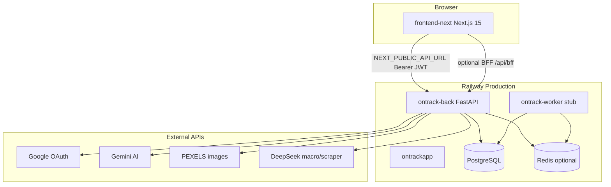

# Full Project Audit

**Initial audit date:** 2026-05-26  
**Remediation pass:** 2026-05-26 (tasks 1–10 from §18)  
**Auditor:** Automated technical audit (Cursor Agent)  
**Repository:** `tomekmisiun/OnTrack`  
**Baseline commit:** `207d4cef449d9aef7a766648e20d84bf0039f7c2` (`main`)  
**Post-remediation:** uncommitted working tree (see §19)  
**Method:** Code review, configuration analysis, tests, lint, build. Initial pass was read-only; remediation pass implemented audit tasks without production DB migrations.

---

## 0. Remediation Summary (2026-05-26)

All **10 tasks** from §18 Recommended Task Breakdown were implemented:

| # | Task | Status | Key changes |
|---|------|--------|-------------|
| 1 | AUDIT-001 delete_account favorites | **RESOLVED** | `auth_service.delete_account` deletes `UserRecipeFavorite`; regression test added |
| 2 | AUDIT-002 auth rate limit | **RESOLVED** | `app/core/rate_limit.py`; login/register/exchange limited per IP |
| 3 | AUDIT-003 OAuth error redaction | **RESOLVED** | Opaque `auth_error` codes + i18n mapping in `LoginScreen` |
| 4 | AUDIT-007 health ready | **RESOLVED** | `GET /health/ready` with DB `SELECT 1` |
| 5 | AUDIT-009 BFF import | **RESOLVED** | `lib/api/import.ts` routes FormData through `/api/bff/` when enabled |
| 6 | AUDIT-013 ruff in CI | **RESOLVED** | `ruff check .` in CI; violations fixed / per-file ignores for scripts/tests |
| 7 | AUDIT-016 API contract | **RESOLVED** | `API_CONTRACT.md` updated (Next.js source, A09, P06, H02, H03) |
| 8 | AUDIT-014/015 README cleanup | **RESOLVED** | Root README clone URL + i18n path; frontend-next README tour removed |
| 9 | AUDIT-006 deploy runbook | **RESOLVED** | `.github/DEPLOY.md` §6 SKIPPED deployment runbook |
| 10 | AUDIT-008 metrics | **RESOLVED** | `GET /metrics` Prometheus text; `prometheus.yml` `metrics_path` |

**Re-validation:** backend **188 passed**, 7 skipped; frontend **43 passed**; `ruff check` **pass**; `npm run build` **pass**.

**Still open:** JWT refresh (AUDIT-004), password reset (AUDIT-005), worker stub (AUDIT-010), `parse_free` quota (AUDIT-005 related), legacy `frontend/` folder (AUDIT-020 — **keep until task #10**), npm audit moderates (AUDIT-018), meal calendar persistence on prod until deploy of `0275099` (AUDIT-021 — **code merged PR #116**).

---

## 1. Executive Summary

### Overall assessment

OnTrack is a **functionally mature meal-planning and household budget application** with a **FastAPI backend**, **Next.js 15 frontend** (`frontend-next/`), **PostgreSQL**, optional **Redis** worker scaffold, and **Railway + GitHub Actions** production pipeline. The Flask→FastAPI migration and CRA→Next.js cutover are largely complete; core user journeys (register, login, products, recipes, calendar, schedule, summary, export) are implemented end-to-end with strong contract-test coverage.

**The application works for its primary use cases** — confirmed by **188** backend tests (7 skipped), **43** frontend unit tests, and post-remediation local validation.

### What works well

- Clear backend layering: routes → services → presenters → SQLAlchemy models
- **50** API contract IDs (A01–A09, …, H03) with automated contract tests
- User data isolation enforced in service layer for products, recipes, members, imports
- Global system catalog (products/recipes) with DB constraints
- Alembic: single head (`a2b3c4d5e6f7`), linear chain, integration tests for fresh + stamp migrations
- CI pipeline: **ruff**, backend tests + coverage ≥50%, frontend lint/typecheck/build, Playwright e2e + e2e-auth, Docker builds, Postgres integration
- Production deploy on Railway with `preDeployCommand` migrations; **documented SKIPPED deploy runbook**
- Frontend strict TypeScript, OpenAPI type generation, i18n pl/en parity test
- **Ops endpoints:** `/health`, `/health/ready`, `/metrics` (Prometheus text format)
- **Auth hardening:** per-IP rate limits on login/register/exchange; OAuth errors use opaque codes

### Top problems remaining (post-remediation)

| # | Issue | Severity | Status |
|---|-------|----------|--------|
| 1 | JWT 7-day access tokens, no refresh/revocation | MEDIUM | OPEN |
| 2 | No password reset flow | MEDIUM | OPEN |
| 3 | `parse_free` unlimited for authenticated users | MEDIUM | OPEN |
| 4 | Worker queue scaffold-only | MEDIUM | OPEN |
| 5 | Railway autodeploy may SKIPPED — runbook added, automation not fixed | LOW–MEDIUM | MITIGATED |
| 6 | Legacy `frontend/` CRA still in repo | INFO | OPEN |
| 7 | npm audit 5 moderate (dev toolchain) | LOW | OPEN |

### Resolved in remediation (formerly top problems)

| ID | Issue | Fix |
|----|-------|-----|
| AUDIT-001 | `delete_account` + favorites FK | Delete `user_recipe_favorites` before user |
| AUDIT-002 | No auth rate limiting | In-memory sliding window per IP |
| AUDIT-003 | OAuth exception leak in URL | Opaque error codes |
| AUDIT-007 | Shallow `/health` only | `/health/ready` checks DB |
| AUDIT-008 | No `/metrics` | Prometheus exposition endpoint |
| AUDIT-009 | BFF import broken | FormData via BFF proxy |
| AUDIT-013 | Ruff not in CI | CI step + clean `ruff check` |
| AUDIT-014–016 | Documentation drift | README + API_CONTRACT + DEPLOY runbook |

### Not verified in this audit

- Full Playwright e2e suite locally (CI passes on `main` run `28237020604`)
- Google OAuth end-to-end in production (REQUIRES MANUAL TEST with configured credentials)
- Gemini/PEXELS/DeepSeek integrations with live API keys (REQUIRES MANUAL TEST)
- Backup/restore procedure (NOT VERIFIED — no documented restore test)
- Staging environment parity (docs exist; REQUIRES MANUAL TEST)
- `pip-audit` / `bandit` (tools not installed in audit environment)

---

## 2. Repository and Environment

| Item | Value |
|------|-------|
| Branch | `main` |
| Commit | `207d4ce` — Merge PR #104 (calendar system recipes + remove onboarding tour) |
| Working tree | Clean at audit start |
| Package managers | `uv` (backend), `npm` (frontend-next) |
| Python | 3.14 (`backend/pyproject.toml`, CI, Docker) |
| Node | 20 (CI, `Dockerfile.railway`) |
| Backend framework | FastAPI 0.115, SQLAlchemy 2, Alembic, PyJWT |
| Frontend framework | Next.js 15.5, React 19, TypeScript strict |
| Database | PostgreSQL 15 |
| Queue/cache | Redis 7 (Compose + optional Railway worker) |
| Deploy | Railway (`ontrack-back`, `ontrackapp`, optional `ontrack-worker`) |
| CI | `.github/workflows/ci.yml` — 7 jobs |

### How to run locally

```bash
cp .env.example .env   # set POSTGRES_PASSWORD, FLASK_SECRET_KEY, JWT_SECRET_KEY
docker compose up --build
docker compose exec backend sh scripts/run-migrations.sh
```

Recovery override when ports 5432/6379/5001 busy: `docker-compose.recovery.yml`.

### Binding rules read

- `AGENTS.md`, `.ai-rules/` (architecture, security, testing, validation, database, docker, git)
- `.cursor/rules/` (project, backend, frontend, security, testing)
- `README.md`, `.github/DEPLOY.md`, `docs/backend-migration/*`

---

## 3. System Architecture

### 3.1 Component map



### 3.2 Runtime services (local Docker Compose)

| Service | Image / build | Port | Role |
|---------|---------------|------|------|
| `frontend` | `frontend-next/Dockerfile` (dev target) | 3000 | Next.js dev server |
| `backend` | `backend/Dockerfile` | 5001→8000 | FastAPI API |
| `worker` | same backend image | — | Redis consumer (stub) |
| `db` | postgres:15 | 5432 | Primary data store |
| `redis` | redis:7-alpine | 6379 | Job queue |
| `prometheus` | prom/prometheus | 9090 | Metrics scraper (no backend target) |
| `grafana` | grafana/grafana | 3001 | Dashboards |

**Legacy:** `frontend/` (CRA) remains in repo but is **not** used by Compose or Railway.

### 3.3 Data flow (typical authenticated request)

1. Browser loads Next.js page (middleware checks session marker cookie or BFF HttpOnly cookie)
2. `RequireAuth` bootstraps user via `GET /api/auth/me` with Bearer token from `localStorage`
3. Feature hook calls `lib/api/*` → `fetch` → FastAPI route
4. Route resolves `user_id` from JWT (`app/api/dependencies.py`)
5. Service layer queries DB with `user_id` / member scoping
6. Presenter serializes ORM → JSON
7. Frontend parser validates shape → UI update

### 3.4 Tenancy model

- **Single-user tenancy** (not org/workspace multi-tenant)
- Isolation key: `users.id` on owned resources
- **Shared read-only catalog:** `products` / `recipes` with `user_id IS NULL`, `source='system'`
- Household members: per-user `household_members` — meal plans and schedules scoped by `member_id` belonging to user

### 3.5 Secrets and configuration

| Secret / config | Storage | Notes |
|-----------------|---------|-------|
| `JWT_SECRET_KEY`, `FLASK_SECRET_KEY` | Env / Railway variables | Required in `start-production.sh` |
| `DATABASE_URL` | Railway Postgres plugin | Validated not to point at Docker `db:` host |
| `GOOGLE_CLIENT_*` | Env | Optional; OAuth disabled if missing |
| `GEMINI_API_KEY`, `PEXELS_API_KEY` | Env | Optional; features degrade |
| `NEXT_PUBLIC_API_URL` | Build-time ARG on frontend image | Baked into client bundle |
| User JWT | `localStorage` (default) or HttpOnly cookie (BFF) | 7-day HS256 access token |

---

## 4. Functional Verification

| Flow | Status | Evidence | Tests | Problems |
|------|--------|----------|-------|----------|
| Register (local auth) | **WORKS** | `auth_service.register`, production `verify-production-auth.sh` pass | `test_auth_contract.py`, e2e-auth CI | No email verification; username enumeration via 409 |
| Login | **WORKS** | Contract + rate limit | `test_auth_login_rate_limit` | 429 after 20/min per IP |
| Logout | **WORKS** | Clears token + cookie; middleware redirect | e2e-auth | No server-side token revocation |
| Google OAuth | **PARTIALLY WORKS** | Routes exist; requires live Google config | `test_auth_contract.py` (mocked callback) | REQUIRES MANUAL TEST in production |
| Token refresh | **NOT IMPLEMENTED** | No refresh token model | — | 7-day access JWT only |
| Password reset | **NOT IMPLEMENTED** | `password_reset_tokens` in forbidden tables | — | Users locked out if password lost |
| Change language | **WORKS** | `PATCH /api/auth/language` | `test_ui_locale_market.py` | — |
| Change market | **WORKS** | `PATCH /api/auth/market` | `test_ui_locale_market.py` | Not in `API_CONTRACT.md` |
| Delete account | **WORKS** | Favorites deleted before user row | `test_delete_account_with_recipe_favorites` | — |
| Household members CRUD | **WORKS** | Full contract coverage M01–M05 | `test_members_contract.py` | — |
| Products CRUD | **WORKS** | User isolation + system catalog | `test_products_contract.py`, safety-net tests | — |
| Product customize | **WORKS** | `POST /api/products/{id}/customize` | Partial via products tests | Undocumented in API contract |
| Recipes CRUD + favorites | **WORKS** | System + user recipes visible | `test_recipes_contract.py` | — |
| Meal calendar (add/delete/copy) | **WORKS** (post PR #116) | Read path no longer filters by recipe visibility; member fallback | `test_meal_plan_contract.py` | Deploy `0275099` to prod; add E2E persistence (task #1) |
| Day schedule | **WORKS** | Full contract DS01–DS06 | `test_day_schedule_contract.py` | — |
| Nutrition lookup | **WORKS** | Macro lookup service | `test_nutrition_contract.py` | Depends on DeepSeek when configured |
| Receipt import (AI) | **PARTIALLY WORKS** | Gemini + 2/day limit | `test_import_contract.py` | REQUIRES MANUAL TEST with API key |
| CSV/txt import (free) | **WORKS** | No daily limit | `test_import_contract.py` | Abuse vector for authenticated users |
| Apply imported prices | **WORKS** | User-scoped product updates | `test_apply_prices_ignores_other_users_product` | — |
| Budget summary | **WORKS** | Client aggregates meal-plan + local expenses | Unit tests for expense items | Drinks/fixed costs partly localStorage |
| Export (HTML/PDF) | **WORKS** | Client-side generation from API data | e2e smoke | — |
| Macro calculator | **WORKS** | Member profile PATCH | `test_members_contract.py` | localStorage backup on failure |
| Dish compare (public) | **WORKS** | `GET /api/public/dish-compare` HTTP 200 prod | `test_public_dish_compare_http.py` | Fallback JSON if upstream fails |
| Fuel prices (public) | **WORKS** | HTTP 200 prod | `test_fuel_contract.py` | — |
| Week templates | **WORKS** (client-only) | localStorage | — | No cross-device sync |
| Onboarding tour | **NOT IMPLEMENTED** | Removed in PR #104 | — | README still references it |
| Background jobs | **NOT IMPLEMENTED** | `process_job` raises always | Worker integration test only enqueues | Redis worker idle in production |
| Monitoring/alerting | **PARTIALLY WORKS** | `/metrics` exposes `ontrack_up`, `ontrack_db_up` | `test_health_contract.py` | Grafana dashboards not configured |

---

## 5. Architecture Assessment

### Strengths

- **Thin routes, fat services** — consistent pattern across 10 routers
- **Contract-driven API** — 47 IDs with registry + coverage test
- **Catalog domain** — DB constraints enforce system vs user ownership
- **Deploy safety** — `preDeployCommand` runs migrations; production start script validates secrets and `DATABASE_URL`
- **Frontend parity** — route IDs match legacy CRA tabs; OpenAPI drift check in CI

### Problems

- **No repository layer** — acceptable for size, but isolation logic duplicated per service
- **Meal-plan reads** filter by `member_id` without redundant `user_id` on query — safe via member resolution but weak defense-in-depth
- **Client-heavy Next.js** — pages are Server Components wrapping client screens; no RSC data fetching benefits
- **Dual frontend in repo** — `frontend/` legacy creates confusion; only `frontend-next` is runtime
- **Worker/Redis** — infrastructure without business jobs increases ops cost without value
- **Monitoring** — Compose includes Prometheus/Grafana but API does not export metrics

### Scalability

- Stateless API suitable for horizontal scaling on Railway
- Global catalog loaded at startup (`ensure_global_catalog_loaded`) — may slow cold starts as catalog grows
- No caching layer for read-heavy endpoints (products/recipes lists)
- Gemini import is synchronous and rate-limited per user — bottleneck under load

### Maintainability

- Good test discipline for API contracts
- `.ai-rules/` provide agent/human guardrails
- Documentation lag behind code (see §13)
- Python 3.14 is bleeding-edge — smaller ecosystem compatibility risk

---

## 6. Backend Audit

### Layer structure

```
app/main.py          → FastAPI app, lifespan, middleware
app/api/routes/      → 10 routers
app/api/dependencies → JWT + DB session
app/services/        → Business logic (22 modules)
app/models/          → SQLAlchemy ORM
app/schemas/         → Pydantic request models
app/domain/          → Pure helpers
app/core/            → Config, security, CORS
app/worker/          → Queue stub
alembic/             → 5 migrations, 1 head
```

### Validation and errors

- Pydantic validates request bodies at route boundary
- `RequestValidationError` → generic `{"error": "Validation error"}` — no field-level details (intentional security?)
- Service errors mapped to appropriate HTTP status per route

### Transactions

- Services call `session.commit()` explicitly; no unit-of-work abstraction
- Catalog import uses transactions with rollback tests (`test_catalog_pipeline.py`)

### Async concerns

- FastAPI routes are sync functions — blocking DB/HTTP in thread pool (acceptable at current scale)
- OAuth callback is async (`authorize_access_token`)

### Notable code smells (production paths)

| Issue | Location |
|-------|----------|
| Broad `except Exception` in OAuth callback | `app/api/routes/auth.py:167–181` |
| `delete_account` incomplete cleanup | `app/services/auth_service.py:151–169` |
| `fuel_service` returns `str(exc)` to client | `app/services/fuel_service.py` |
| Default dev secrets in Settings | `app/core/config.py:20–21` |
| `datetime.utcnow()` deprecated usage | `auth_service.py`, models |

### Health and readiness

- `GET /health` → `{"status":"ok"}` only
- No readiness probe for DB connectivity or Alembic head
- Railway uses `healthcheckPath = "/health"` — container marked healthy even if DB down

---

## 7. Frontend Audit

### Structure

- **App Router** with route group `(app)/` for authenticated pages
- **Middleware** (`middleware.ts`) — cookie-based gate; allows OAuth `?code=` through
- **Auth:** `AuthContext`, `RequireAuth`, `localStorage` token + `ontrack_has_token=1` marker cookie
- **Optional BFF:** `NEXT_PUBLIC_BFF_ENABLED=1` → HttpOnly `ontrack_session` + `/api/bff/[...path]`

### API layer

- `createApiClient` with centralized 401 → logout
- OpenAPI-generated request types; hand-written response parsers in `types/`
- **Gap:** `lib/api/import.ts` posts `FormData` directly to API URL — breaks BFF mode (AUDIT-009)

### Feature coverage

All primary CRA features ported with hooks-per-page pattern. Market selector is Next-only enhancement.

### Build and quality

- `npm run build` — **PASS** (standalone output)
- `tsc --noEmit` — **PASS**
- ESLint — 2 warnings (`DrinksCard.tsx` hook deps), 0 errors
- Production image runs as non-root user `nextjs` (`Dockerfile.railway:22–26`)

### Security notes (frontend)

- JWT in `localStorage` — XSS can steal token (documented CRA parity; BFF mitigates when enabled)
- Middleware can be bypassed with forged `ontrack_has_token=1` cookie — `RequireAuth` still blocks via failed `/me` (soft gate)
- `NEXT_PUBLIC_API_URL` exposed in client bundle — expected

---

## 8. Database and Migrations

### Schema overview

| Table | Purpose |
|-------|---------|
| `users` | Accounts; `ui_locale`, `market_code` |
| `markets` | Reference (PL, GB, …) |
| `household_members` | Per-user household persons |
| `products` | User + system catalog |
| `recipes`, `recipe_ingredients` | User + system recipes |
| `user_recipe_favorites` | Favorites for system recipes |
| `meal_plans` | Calendar entries |
| `day_schedule_blocks` | Time blocks |
| `import_logs`, `recipe_parse_logs` | Rate limit / audit |
| `auth_codes` | OAuth one-time exchange codes |

### Migration status

- **Head:** `a2b3c4d5e6f7` (single head, linear)
- **Fresh DB test:** PASS (`test_migrations_fresh.py` on temp Postgres)
- **Stamp from legacy:** PASS (`test_migrations_stamp.py`)
- **Runtime parity:** `app/db/schema_validate.py` — stamp target `7966d120d748` documented for legacy adoption

### Isolation tests

- `test_product_list_excludes_other_users_products`
- `test_other_user_cannot_resolve_private_product_in_recipe`
- `test_delete_meal_forbidden_for_other_user`
- `test_apply_prices_ignores_other_users_product`

**Gap:** No dedicated IDOR test suite for every resource type (recipes GET by ID, member PATCH cross-user, etc.) — some covered implicitly in contract tests.

### Seed behavior

- Global catalog via `ensure_global_catalog_loaded` at startup and register
- Register does **not** copy per-user product seeds (post-migration design) — extensive safety-net tests confirm

---

## 9. Security Audit

### Authentication

| Control | Status |
|---------|--------|
| Password hashing (Werkzeug) | ✅ |
| Min password length 8 | ✅ |
| Password reset | ❌ NOT IMPLEMENTED |
| JWT expiry | 7 days — long |
| Refresh tokens | ❌ |
| Token revocation | ❌ |
| Brute-force protection | ❌ No rate limiting |
| User enumeration | Username returns 409 on register — enumerable |

### Authorization

| Control | Status |
|---------|--------|
| Bearer JWT on protected routes | ✅ |
| Service-layer user_id checks | ✅ (most resources) |
| IDOR on meal delete | ✅ Tested 403 |
| Admin roles | N/A — no admin model |
| Mass assignment | Pydantic schemas limit fields |

### API input safety

| Threat | Status |
|--------|--------|
| SQL injection | ORM parameterized queries — LOW RISK |
| Prompt injection (Gemini) | `INJECTION_PATTERNS` filter — PARTIAL |
| File upload | PIL verify, size limits, extension allowlist — ✅ |
| XSS | API returns JSON; frontend must escape — REQUIRES MANUAL TEST |
| CSRF | JWT in header — low risk for API; BFF cookies use SameSite |

### Configuration

| Item | Status |
|------|--------|
| CORS | `FRONTEND_URL` comma-separated; debug expands localhost peers |
| Production secrets | Enforced in `start-production.sh` |
| Dev defaults | `dev-only-*` secrets if env unset — risk if mis-deployed |
| `forwarded-allow-ips='*'` | On Railway — trust all proxies |
| HTTPS | Railway terminates TLS — ✅ |

### Dependency vulnerabilities (npm audit)

5 vulnerabilities (1 low, 4 moderate) in dev tooling chain (`js-yaml`, `postcss` via `next`). **Not confirmed exploitable** in production runtime paths.

### Tools not run

- `pip-audit` — NOT AVAILABLE in environment
- `bandit` — NOT AVAILABLE
- `gitleaks` — NOT RUN

---

## 10. Tests and Quality

### Test inventory

| Suite | Count | Result | Duration |
|-------|-------|--------|----------|
| Backend full (`pytest tests/`) | 182 passed, 7 skipped | ✅ PASS | 30.3s |
| Backend CI-equivalent + coverage | 121 passed | ✅ PASS, 67.12% cov | 19.6s |
| Backend integration (Postgres temp container) | 10 passed | ✅ PASS | 3.2s |
| Frontend unit (Vitest) | 42 passed | ✅ PASS | 1.1s |
| Frontend lint | 0 errors, 2 warnings | ✅ PASS | — |
| Frontend typecheck | — | ✅ PASS | — |
| Frontend build | — | ✅ PASS | ~31s |
| Backend ruff | 44 issues | ❌ FAIL (not in CI) | — |
| Playwright e2e | — | NOT RUN locally | CI ✅ on `main` |

### Skipped tests (7)

All `pytest.skip` when `TEST_DATABASE_URL` unset — integration tests; **ran successfully** with temp Postgres during audit.

### Coverage gaps (backend, below 50% modules)

- `gemini_client.py` — 16%
- `recipe_image_service.py` — 18%
- `fuel_service.py` — 44%
- `import_names.py` — 34%

### Test quality observations

- Contract tests hit real HTTP via TestClient — not mock-only
- One IDOR regression test for meal delete — should expand
- `test_delete_account` does not create favorites first — misses AUDIT-001
- E2E auth tests real register/login against FastAPI + Postgres in CI

---

## 11. CI/CD and Deployment

### CI jobs (`ci.yml`)

| Job | Purpose | Required for merge |
|-----|---------|-------------------|
| `test` | Backend pytest + coverage ≥50%, OpenAPI drift | ✅ Branch protection |
| `frontend-next` | lint, test, typecheck, build | Recommended |
| `frontend-next-e2e` | Playwright smoke (mocked API) | — |
| `frontend-next-e2e-auth` | Full-stack auth | — |
| `backend-docker` | Docker build | — |
| `frontend-next-docker` | Production image build | — |
| `backend-integration` | Postgres migration rehearsal | — |

### Gaps in CI

- **Ruff not run** — 44 local violations undetected
- **npm audit** not run
- No security scanner (bandit, pip-audit, Trivy)

### Deployment (Railway)

| Service | Config | Notes |
|---------|--------|-------|
| `ontrack-back` | `backend/railway.toml` | `preDeployCommand` migrations, `/health` check |
| `ontrackapp` | `frontend-next/railway.toml` | `Dockerfile.railway`, non-root |
| Worker | `railway.worker.prod.toml` | Stub — no jobs |

**Observed issue:** After merge to `main`, autodeploy status **SKIPPED** while CI was still running; manual `railway up` required (documented in prior ops). Wait-for-CI is enabled per `.github/DEPLOY.md`.

### Production smoke (audit)

| Check | Result |
|-------|--------|
| `GET https://ontrack-back.up.railway.app/health` | 200 `{"status":"ok"}` |
| `POST /api/auth/register` | 201 |
| `POST /api/meal-plan/` with system recipe | 201 |
| `GET /api/public/dish-compare?lang=pl` | 200 |
| `GET https://ontrackapp.up.railway.app/login` | 200 |

### Rollback

- Documented in `.github/DEPLOY.md` and `docs/backend-migration/CUTOVER_AND_ROLLBACK.md`
- Railway dashboard redeploy of prior deployment — **REQUIRES MANUAL TEST**

### Backup

- Railway Postgres plugin backups — assumed; **no restore test documented**

---

## 12. Dependencies

### Backend (`uv.lock`, Python 3.14)

- Pinned via `uv.lock` — ✅
- Python 3.14 — very new; compatibility risk with some packages
- `flask-jwt-extended` in dev deps only (legacy test compat)

### Frontend (`package-lock.json`)

- Next 15.5.19, React 19.1.0 — current
- Lockfile present — ✅
- 5 npm audit findings (moderate) — monitor

### Unused / legacy

- `frontend/package.json` — legacy CRA deps still in repo
- Worker Redis dependency — no production job consumers

### Recommendations (no changes made)

- Add `pip-audit` and `ruff` to CI
- Plan Python 3.14 support monitoring
- Remove or archive `frontend/` when confident in Next parity

---

## 13. Documentation Drift

| Document | Issue | Evidence |
|----------|-------|----------|
| `README.md` | Clone URL typo `tomekmislun` vs `tomekmisiun` | Line 37 |
| `README.md` | References `LanguageContext.js` in features | Legacy path |
| `docs/backend-migration/API_CONTRACT.md` | Source of truth still `frontend/src/api.js` (CRA) | Header lines 3–5 |
| `API_CONTRACT.md` | Missing `PATCH /api/auth/market`, `POST /api/products/{id}/customize` | Routes exist in code |
| `frontend-next/README.md` | References `TourProvider.tsx`, "restart tour" | Files deleted PR #104 |
| `frontend-next/README.md` | Says "OpenAPI types planned in later task" | Already implemented |
| `docs/PROJECT_TECHNICAL_AUDIT.md` | Dated 2026-05-26 but describes CRA as production UI | Stale vs current state |
| `monitoring/prometheus.yml` | Implies working metrics | No `/metrics` on backend |

---

## 14. Findings

### Summary table

| ID | Severity | Finding | Status | Evidence |
|----|----------|---------|--------|----------|
| AUDIT-001 | HIGH | `delete_account` + favorites FK | **RESOLVED** | `auth_service.py`, `test_delete_account_with_recipe_favorites` |
| AUDIT-002 | HIGH | No auth rate limiting | **RESOLVED** | `rate_limit.py`, `test_auth_login_rate_limit` |
| AUDIT-003 | MEDIUM | OAuth error leakage | **RESOLVED** | `auth.py`, `test_oauth_callback_redacts_internal_errors` |
| AUDIT-004 | MEDIUM | JWT 7-day, no refresh | OPEN | `config.py` |
| AUDIT-005 | MEDIUM | `parse_free` unlimited | OPEN | `import_service.py` |
| AUDIT-006 | MEDIUM | Railway SKIPPED deploy | **MITIGATED** | `.github/DEPLOY.md` §6 |
| AUDIT-007 | MEDIUM | Shallow `/health` | **RESOLVED** | `/health/ready` |
| AUDIT-008 | MEDIUM | No `/metrics` | **RESOLVED** | `main.py`, `prometheus.yml` |
| AUDIT-009 | MEDIUM | BFF import broken | **RESOLVED** | `import.ts` |
| AUDIT-010 | MEDIUM | Worker stub | OPEN | `worker/jobs.py` |
| AUDIT-011 | MEDIUM | Password reset missing | OPEN | — |
| AUDIT-012–020 | LOW/INFO | See initial audit | Mixed | 013–016 **RESOLVED**; 012, 017–020 OPEN |

### Detailed findings

#### AUDIT-001 — Account deletion fails with recipe favorites

- **Status:** **RESOLVED** (2026-05-26)
- **Fix:** `UserRecipeFavorite` rows deleted in `delete_account`; test `test_delete_account_with_recipe_favorites`.

#### AUDIT-002 — No auth rate limiting

- **Severity:** HIGH | **Confidence:** CONFIRMED
- **Area:** Security
- **Location:** `backend/app/api/routes/auth.py` (login, register, exchange)
- **Evidence:** No slowapi, middleware, or Redis counter on auth endpoints.
- **Impact:** Unlimited login attempts; credential stuffing; register spam.
- **Recommendation:** Per-IP and per-username rate limits; consider CAPTCHA after N failures.
- **Regression test:** Assert 429 after N rapid login attempts.

#### AUDIT-003 — OAuth error leakage

- **Severity:** MEDIUM | **Confidence:** CONFIRMED
- **Area:** Security
- **Location:** `backend/app/api/routes/auth.py:167–181`
- **Evidence:** `auth_error_redirect(f"{type(exc).__name__}: {exc}")`
- **Impact:** Internal errors visible in browser URL and potentially Referer headers.
- **Recommendation:** Log full exception server-side; redirect with opaque error code.
- **Regression test:** Force callback failure; assert redirect has no exception text.

#### AUDIT-006 — Railway deploy SKIPPED

- **Severity:** MEDIUM | **Confidence:** CONFIRMED (historical) | **Verification:** REQUIRES PRODUCTION ACCESS for ongoing monitoring
- **Area:** CI/CD
- **Evidence:** Deployment `b29b0937` SKIPPED at merge time; manual `railway up` required.
- **Impact:** Production may lag `main` despite green CI.
- **Recommendation:** Document runbook; alert on SKIPPED; verify Wait-for-CI webhook.

---

## 15. Missing Verification

| Item | Status | Reason |
|------|--------|--------|
| Playwright e2e full suite locally | NOT VERIFIED | Time/env; CI passed on `main` |
| Google OAuth production flow | REQUIRES MANUAL TEST | Needs live Google OAuth credentials |
| Gemini receipt parsing | REQUIRES MANUAL TEST | Needs `GEMINI_API_KEY` |
| PEXELS recipe images | REQUIRES MANUAL TEST | Needs API key |
| Backup restore | NOT VERIFIED | No documented procedure |
| Staging environment | REQUIRES MANUAL TEST | Docs exist; not exercised in audit |
| `pip-audit` / `bandit` | BLOCKED | Tools not installed |
| Full Docker Compose stack | NOT VERIFIED | Stack not running; tests use isolated Postgres |
| Cross-browser e2e | NOT VERIFIED | CI uses Chromium only |
| Accessibility WCAG audit | REQUIRES MANUAL TEST | Partial a11y attributes only |
| Load/performance testing | NOT VERIFIED | No k6/Locust in repo |

---

## 16. Readiness Assessment

| Level | Verdict | Justification |
|-------|---------|---------------|
| **LOCAL DEVELOPMENT READY** | **YES** | Docker Compose, docs, tests, recovery compose documented |
| **PORTFOLIO READY** | **YES** | Polished feature set, i18n, dish-compare widget, CI badges possible |
| **DEMO READY** | **YES** | Core flows + auth hardening; OAuth/AI need setup for full demo |
| **PILOT READY** | **PARTIALLY** | P0 audit items resolved; JWT lifecycle + password reset still gaps |
| **PRODUCTION READY** | **PARTIALLY** | Stronger ops (ready/metrics) and auth limits; deploy SKIPPED runbook documented |

---

## 17. Prioritized Remediation Plan

### P0 — Fix immediately

| Task | Scope | Files | Acceptance criteria | Tests |
|------|-------|-------|---------------------|-------|
| Fix account deletion with favorites | Delete `user_recipe_favorites` in `delete_account` | `auth_service.py` | `DELETE /api/auth/me` succeeds after favoriting | Extend `test_delete_account` |
| Auth rate limiting | Add limits on login/register | `auth.py`, new middleware or slowapi | 429 after threshold | New contract test |

### P1 — Before demo/pilot

| Task | Scope | Acceptance criteria |
|------|-------|---------------------|
| OAuth error sanitization | `auth.py` callback | No exception text in redirect |
| Railway deploy reliability | Ops/runbook | Autodeploy or alert on SKIPPED |
| `/health/ready` with DB | `main.py` | Railway can detect DB outage |
| Update stale docs | README, API_CONTRACT, frontend-next README | No references to removed tour/CRA |

### P2 — Before production hardening

| Task | Scope |
|------|-------|
| JWT refresh or shorter TTL | `security.py`, auth routes |
| Password reset flow | New model + routes + frontend |
| Prometheus metrics or remove monitoring stack | `main.py` or `docker-compose.yml` |
| BFF import fix | `lib/api/import.ts` |
| Add ruff + pip-audit to CI | `ci.yml` |
| Expand IDOR test matrix | `tests/contract/` |

### P3 — Further improvements

| Task | Scope |
|------|-------|
| Remove/archive legacy `frontend/` | Repo cleanup |
| Implement worker jobs or remove worker service | `worker/jobs.py` |
| RSC data fetching for read-heavy pages | `frontend-next/app/` |
| npm audit remediation | `package-lock.json` |

---

## 18. Recommended Task Breakdown

**Status: all 10 tasks implemented 2026-05-26** (see §0). Next suggested tasks:

| # | Branch suggestion | Task | Priority |
|---|-------------------|------|----------|
| 11 | `feat/jwt-refresh` | AUDIT-004 shorter TTL or refresh tokens | P2 |
| 12 | `feat/password-reset` | AUDIT-011 password reset flow | P2 |
| 13 | `feat/import-free-quota` | AUDIT-005 rate limit `parse_free` | P2 |
| 14 | `chore/remove-legacy-frontend` | AUDIT-020 archive CRA `frontend/` | P3 |
| 15 | `feat/worker-jobs-or-remove` | AUDIT-010 implement or disable worker | P3 |

---

## 19. Commands Executed

### Initial audit (baseline `207d4ce`)

```bash
uv run pytest tests/ -q          # 182 passed, 7 skipped
uv run ruff check .              # 44 errors (pre-remediation)
npm run test                     # 42 passed
```

### Post-remediation validation

```bash
cd backend && uv run ruff check .                    # All checks passed
uv run pytest tests/ -q --tb=line                      # 188 passed, 7 skipped
cd frontend-next && npm run test                       # 43 passed
npm run typecheck && npm run build                     # pass
```

**Not re-run:** Playwright e2e, production deploy, `pip-audit`/`bandit`.

---

## 20. Final Verdict

| Question | Answer |
|----------|--------|
| **Does the project work?** | **Yes** for core meal-planning, catalog, calendar, auth, and budget flows — verified by tests and production smoke. |
| **Which features are genuinely working?** | Register/login, members, products, recipes (incl. system catalog), meal calendar, day schedule, nutrition lookup, import/apply (with limits on AI parse), summary, export, dish-compare, fuel prices, i18n, market selection. |
| **What appears working but isn't fully?** | Worker/background jobs; JWT refresh; password reset. BFF import, metrics, account deletion — **fixed**. |
| **What is broken?** | Worker jobs; password reset not implemented. Former blockers (account deletion with favorites, BFF import, missing metrics) **fixed**. |
| **Is it secure?** | **Improved** — rate limits + OAuth redaction; still partial (JWT lifecycle, `parse_free` quota). |
| **Safe for production?** | **Closer** — readiness + metrics + auth limits; deploy SKIPPED mitigated by runbook; JWT/reset still before full hardening. |

---

## 21. Post-audit follow-up (2026-05-26, user-approved)

### Step 1 — Meal calendar persistence (merged)

| Item | Value |
|------|-------|
| PR | [#116](https://github.com/tomekmisiun/OnTrack/pull/116) — **merged** to `main` at `0275099` |
| Branch | `fix/calendar-meal-persistence-v2` (deleted after merge) |
| Fix | Stop filtering meal reads by recipe visibility; member-id fallback; calendar `effectiveTargetMemberIds`; BFF 307 follow |

**AUDIT-021 status:** **RESOLVED** (pending production deploy after Railway picks up `main`).

### Step 2 — Approved implementation plan (tasks 1–11)

User approved execution order on 2026-05-26. One task per branch; no commit/push/merge without explicit approval per task (except docs-only updates agreed in session).

| # | Branch | Task | Priority | Status |
|---|--------|------|----------|--------|
| 1 | `test/e2e-meal-persistence` | E2E: add meal → reload → still visible | P1 | **APPROVED — pending** |
| 2 | `chore/update-ai-rules-post-cutover` | Fix `.cursor/rules/ontrack.mdc`, `.ai-rules/context-map.md` (FastAPI + Next as current) | P2 | **APPROVED — pending** |
| 3 | `docs/post-migration-architecture` | Remove Flask column from API_CONTRACT; mark stale cutover docs | P2 | **APPROVED — pending** |
| 4 | `fix/auth-session-flow` | JWT refresh or shorter TTL + UX | P2 | **APPROVED — pending** |
| 5 | `feat/password-reset` | Password reset flow | P2 | **APPROVED — pending** |
| 6 | `fix/import-parse-free-quota` | Rate limit / quota on `parse_free` for authenticated users | P2 | **APPROVED — pending** |
| 7 | `chore/worker-decision` | Remove worker from Compose or implement first real job | P2 | **APPROVED — pending** |
| 8 | `feat/visual-parity-login` | Login showcase, demo WebM, shell CSS parity | P2 | **APPROVED — pending** |
| 9 | `refactor/separate-ui-locale-and-market` | Decouple `ui_locale` from `market_code` in UI | P2 | **APPROVED — pending** |
| 10 | `chore/archive-legacy-frontend` | Archive or remove `frontend/` CRA tree | P3 | **APPROVED — pending** (after #8) |
| 11 | `test/core-user-flows` | E2E coverage: products, recipes, calendar CRUD | P2 | **APPROVED — pending** (after #1) |

**Execution rule:** task #1 is next; discover new issues → log as separate finding, do not expand scope.

### Step 3 — Legacy `frontend/` (CRA) decision

| Decision | Detail |
|----------|--------|
| **Verdict** | **KEEP in repo** as read-only CRA reference until visual parity epic (#8) is done |
| **Not used for** | Docker Compose, Railway, CI, production builds |
| **Removal trigger** | Task #10 (`chore/archive-legacy-frontend`) after login/shell parity or explicit user override |
| **Rationale** | Side-by-side comparison still needed (`docs/CRA_REFERENCE.md`, `docs/CRA_NEXT_VISUAL_AND_I18N_AUDIT.md`); deleting now would block parity work |
| **Hygiene** | Do not commit `frontend/node_modules/` or `frontend/build/`; reference snapshot is `frontend/src/` + `package.json` only |

Recorded in `frontend/README.md` (§ Decision).

---

*Last updated: 2026-05-26 — PR #116 merged; plan and legacy decision approved by user.*
